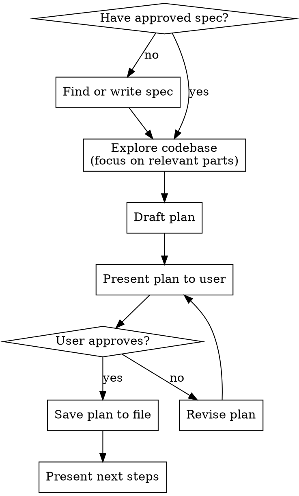

У канон CI входить Swatinem/rust-cache@v2 з правильно. Clippy --fix у скрипті, але в CI без --fix - зрозуміло.

Наступне питання: fix.mjs -- чи включити будь-яку авто-виправку, наприклад write template files если чогось не вистачає?
[assistant]
[thinking]

[assistant]
Питання про fix.mjs. Глянемо як abie і style-lint реалізують fix — чи `fix.mjs` тут — entry-point тільки для check, чи там є й авто-виправка.
[assistant]
[tool: Read] {"file_path":"/Users/vitaliytv/www/nitra/cursor/npm/rules/abie/fix.mjs"}
[user]
[tool_result] 1	import { runStandardRule } from '../../scripts/utils/run-standard-rule.mjs'
[assistant]
[tool: Read] {"file_path":"/Users/vitaliytv/www/nitra/cursor/npm/rules/style-lint/fix.mjs"}
[user]
[tool_result] 1	import { runStandardRule } from '../../scripts/utils/run-standard-rule.mjs'
[assistant]
[tool: Read] {"file_path":"/Users/vitaliytv/www/nitra/cursor/npm/scripts/utils/run-standard-rule.mjs"}
[user]
[tool_result] 1	/**
[assistant]
[tool: Bash] {"command":"grep -n \"fix\\|template\\|write\\|autofix\" /Users/vitaliytv/www/nitra/cursor/npm/scripts/utils/run-standard-rule.mjs | head -20","description":"Look for fix/autofix in run-standard-rule"}
[user]
[tool_result] (Bash completed with no output)
[assistant]
[tool: Bash] {"command":"grep -rn \"template\\|autofix\\|write.*file\" /Users/vitaliytv/www/nitra/cursor/npm/rules/style-lint/js/tooling/check.mjs | head -20","description":"Look for template writes in style-lint check"}
[user]
[tool_result] 1:/Users/vitaliytv/www/nitra/cursor/npm/rules/style-lint/js/tooling/check.mjs:28:  * Зареєстровані JS-concerns правила `style-lint`:
[assistant]
[tool: Bash] {"command":"grep -n \"inlineTempl\\|write\\|scaffold\\|create\" /Users/vitaliytv/www/nitra/cursor/npm/rules/style-lint/js/tooling/check.mjs | head -10","description":"Check for inline template or file writing in style-lint"}
[user]
[tool_result] (Bash completed with no output)
[assistant]
[tool: Bash] {"command":"grep -rn \"inlineTemplate\\|applyTemplate\\|writeFile\" /Users/vitaliytv/www/nitra/cursor/npm/scripts/ 2>/dev/null | head -15","description":"Look for template/write utilities"}
[user]
[tool_result] /Users/vitaliytv/www/nitra/cursor/npm/scripts/utils/run-standard-rule.mjs:34:   * @param {import('./types-runner.mjs').PolicyRunner} runner.runConftestBatch - runs rego policies, each policy
[assistant]
[tool: Bash] {"command":"grep -rn \"template\\|write\\|fix_action\\|create_file\" /Users/vitaliytv/www/nitra/cursor/npm/rules/js-lint/js/tooling/check.mjs | grep -v \"^\\s*\\*\" | head -15","description":"Look for any auto-fix in js-lint check"}
[user]
[tool_result] (Bash completed with no output)
[assistant]
[thinking]

[assistant]
Зрозуміло: жодне правило (abie, style-lint, js-lint) — не пише файли в `fix.mjs` / `check.mjs`. Всі `fix.mjs` — виключно entry-point для `runStandardRule`. Авто-виправки немає, тільки перевірки з hint-ами «additional_details» / шаблонними сніпетами у rego. Тобто `fix.mjs` в назві не означає авто-виправку — це IoC-назва entry-point'а для rule-runner.
[assistant]
У поточному паттерні проєкту `fix.mjs` — це **entry-point для check/policy runner**, не авто-виправка. Жодне правило (`js-lint`, `style-lint`, `abie`) не пише файли автоматично — замість цього rego / JS виводять hint з `inlineTemplateLinks`, і agent/розробник самостійно копіює snippet.

Отже для `rust` так само: `fix.mjs` = entry-point (8 рядків, `runStandardRule`), авто-виправка відсутня. Якщо хочеш відступити від паттерну і додати автозапис (наприклад, scaffold `lint-rust.yml` якщо файл відсутній) — це буде перший прецедент у цьому проєкті; потребуватиме окремого дизайнерського рішення.

**Рекомендація:** не включати авто-виправку, щоб залишитися в рамках існуючого паттерну. Погоджуєшся?
[user]
не включаємо

Є ще момент: потрібно додати правило також в `.cursor/rules/` в проєкт, там є файл cursor/CLAUDE.md з @-рядком для кожного правила. Як ми плануємо синхронізацію rust.mdc ↔ n-rust.mdc?
[assistant]
[thinking]

[assistant]
Глянемо, як влаштована синхронізація для існуючих правил — звідки `.cursor/rules/n-*.mdc` беруться.
[assistant]
[tool: Bash] {"command":"grep -n \"mdc\\|copy\\|sync\\|cursor.*rules\" /Users/vitaliytv/www/nitra/cursor/npm/bin/n-cursor.js | head -30","description":"Find sync logic in n-cursor.js"}
[user]
[tool_result] 16:  * - Якщо в `.cursor/rules/` немає правила — копіює його туди з пакету.
16:  * - Якщо в `.cursor/rules/` немає правила — копіює його туди з пакету.
[assistant]
[tool: Read] {"file_path":"/Users/vitaliytv/www/nitra/cursor/npm/bin/n-cursor.js","offset":1,"limit":150}
[user]
[tool_result] 1	#!/usr/bin/env node
[assistant]
[tool: Bash] {"command":"grep -n \"n-rust\\|n-tauri\\|rules.*copy\\|writeFileSync\\|copyFile\" /Users/vitaliytv/www/nitra/cursor/npm/bin/n-cursor.js | head -20","description":"Look for copy logic for n-tauri/n-rust in n-cursor.js"}
[user]
[tool_result] (Bash completed with no output)
[assistant]
[tool: Bash] {"command":"grep -rn \"n-tauri\\|@.*n-tauri\" /Users/vitaliytv/www/nitra/cursor/ --include=\"*.md\" | head -10","description":"Find n-tauri in CLAUDE.md or similar docs"}
[user]
[tool_result] (Bash completed with no output)
[assistant]
[tool: Bash] {"command":"grep -n \"tauri\\|n-style\\|n-js-lint\" /Users/vitaliytv/www/nitra/cursor/CLAUDE.md 2>/dev/null | head -10","description":"Check CLAUDE.md for tauri/style-lint entries"}
[user]
[tool_result] (Bash completed with no output)
[assistant]
[tool: Bash] {"command":"cat /Users/vitaliytv/www/nitra/cursor/CLAUDE.md 2>/dev/null | head -30","description":"CLAUDE.md in cursor/"}
[user]
[tool_result] @.cursor/rules/conftest.mdc
@.cursor/rules/dev-dep.mdc
@.cursor/rules/n-adr.mdc
@.cursor/rules/n-bun.mdc
@.cursor/rules/n-changelog.mdc
@.cursor/rules/n-ci4.mdc
@.cursor/rules/n-feedback.mdc
@.cursor/rules/n-ga.mdc
@.cursor/rules/n-js-lint.mdc
@.cursor/rules/n-js-run.mdc
@.cursor/rules/n-npm-module.mdc
@.cursor/rules/n-rego.mdc
@.cursor/rules/n-security.mdc
@.cursor/rules/n-style-lint.mdc
@.cursor/rules/n-text.mdc
@.cursor/rules/n-vue.mdc
@.cursor/rules/scripts.mdc
[assistant]
[thinking]

[assistant]
[tool: Bash] {"command":"ls /Users/vitaliytv/www/nitra/cursor/.cursor/rules/ | head -20","description":"List .cursor/rules in cursor project"}
[user]
[tool_result] conftest.mdc
dev-dep.mdc
n-adr.mdc
n-bun.mdc
n-changelog.mdc
n-ci4.mdc
n-feedback.mdc
n-ga.mdc
n-js-lint.mdc
n-js-run.mdc
n-npm-module.mdc
n-rego.mdc
n-security.mdc
n-style-lint.mdc
n-text.mdc
n-vue.mdc
scripts.mdc
[assistant]
[thinking]

[assistant]
[tool: Bash] {"command":"diff /Users/vitaliytv/www/nitra/cursor/.cursor/rules/n-js-lint.mdc /Users/vitaliytv/www/nitra/cursor/npm/rules/js-lint/js-lint.mdc 2>&1 | head -20","description":"Compare n-js-lint.mdc with npm/rules/js-lint.mdc"}
[user]
[tool_result] (Bash completed with no output)
[assistant]
[thinking]

[assistant]
Файли ідентичні — це підтверджує: `.cursor/rules/n-<id>.mdc` є точна копія `npm/rules/<id>/<id>.mdc`. Синхронізація відбувається через `npx @nitra/cursor` (команда без підкоманди) — вона копіює `.mdc`-файли з пакету у `.cursor/rules/`. Немає окремого процесу; це ручна/CI-команда.

Тобто `n-rust.mdc` буде **просто копія** `npm/rules/rust/rust.mdc` у `.cursor/rules/`. Нема складнощів.
[assistant]
Механізм синхронізації:

- `npx @nitra/cursor` (команда без підкоманди) копіює `npm/rules/<id>/<id>.mdc` → `.cursor/rules/n-<id>.mdc`.
- Підтверджено diff: `n-js-lint.mdc` ≡ `js-lint/js-lint.mdc` (нуль різниці).
- Тобто `n-rust.mdc` = точна копія `npm/rules/rust/rust.mdc` — ніякого особливого синхронізатора.

**Що треба зробити в рамках цього правила:**
1. Створити `npm/rules/rust/rust.mdc` (одне джерело правди).
2. Скопіювати / symlink в `.cursor/rules/n-rust.mdc` (зазвичай `npx @nitra/cursor` це зробить, але для dev можна одразу скопіювати).
3. Додати рядок `@.cursor/rules/n-rust.mdc` у `cursor/CLAUDE.md`.

Усі три кроки входять у план реалізації. Ніяких спеціальних змін у `n-cursor.js` не потрібно — механізм копіювання вже є.

Підходить? Тоді можу записати дизайн-документ і перейти до `writing-plans`.
[user]
підходить
[assistant]
[tool: TodoWrite] {"todos":[{"content":"Explore project context (rules structure, lint-js, tauri, package.json patterns)","activeForm":"Exploring project context","status":"completed"},{"content":"Ask clarifying questions one at a time","activeForm":"Asking clarifying questions","status":"completed"},{"content":"Prop
[user]
[tool_result] Todos have been modified successfully. Ensure that you continue to use the todo list to track your progress. Please proceed with the current tasks if applicable
[assistant]
Записую design-документ.
[assistant]
[tool: Write] {"file_path":"/Users/vitaliytv/www/nitra/cursor/docs/superpowers/specs/2026-05-23-rust-rule-design.md","content":"# Правило `rust` — design\n\n**Дата:** 2026-05-23  \n**Автор:** brainstorm-сесія (vitaliytv ↔ Claude)  \n**Статус:** approved → ready for writing-plans\n\n## Мотивація\n\nПроєкти з Rust-кодом (Tauri, stand-alone CLI) не мають уніфікованого набору перевірок:\n- відсутній канонічний скрипт `lint-rust` у `package.json`;\n- відсутній CI workflow для Rust;\n- VS Code без `rust-analyzer` і `even-better-toml` є типовою проблемою при онбординзі.\n\nСтворюємо правило **`rust`** — аналог `js-lint` / `style-lint` для Rust-кодобаз.\n\n---\n\n## Рішення\n\nНова папка `npm/rules/rust/` з rego-heavy перевіркою трьох документів:\n`package.json`, `.vscode/extensions.json`, `.github/workflows/lint-rust.yml`.\n\n---\n\n## Структура каталогу\n\n```\nnpm/rules/rust/\n├── rust.mdc\n├── auto.md\n├── fix.mjs                              # entry-point → runStandardRule\n├── js/\n│   ├── applies/\n│   │   └── check.mjs                    # exists Cargo.toml\n│   └── tooling/\n│       └── check.mjs                    # orchestrator + runConftestBatch\n└── policy/\n    ├── package_json/\n    │   ├── target.json\n    │   ├── package_json.rego\n    │   ├── package_json_test.rego\n    │   └── template/\n    │       └── package.json.snippet.json\n    ├── vscode_extensions/\n    │   ├── target.json\n    │   ├── vscode_extensions.rego\n    │   ├── vscode_extensions_test.rego\n    │   └── template/\n    │       └── extensions.json.snippet.json\n    └── lint_rust_yml/\n        ├── target.json\n        ├── lint_rust_yml.rego\n        ├── lint_rust_yml_test.rego\n        └── template/\n            └── lint-rust.yml.snippet.yml\n```\n\n---\n\n## Canonical документи\n\n### `scripts.lint-rust` у `package.json`\n\n```json\n\"lint-rust\": \"cargo fmt --all && cargo clippy --fix --allow-staged --allow-dirty --all-targets --all-features && cargo clippy --all-targets --all-features -- -D warnings\"\n```\n\nRegо перевіряє substring-match для трьох ключів: `cargo fmt`, `cargo clippy --fix`, `cargo clippy ... -- -D warnings`.\n\n### `.vscode/extensions.json`\n\n```json\n{\n  \"recommendations\": [\n    \"rust-lang.rust-analyzer\",\n    \"tamasfe.even-better-toml\"\n  ]\n}\n```\n\nRego — `contains` для обох ID (не вимагає рівності множини).\n\n### `.github/workflows/lint-rust.yml`\n\n```yaml\nname: Lint Rust\n\non:\n  push:\n    branches: [dev, main]\n    paths:\n      - '**/*.rs'\n      - '**/Cargo.toml'\n      - '**/Cargo.lock'\n      - '**/rustfmt.toml'\n      - '**/clippy.toml'\n  pull_request:\n    branches: [dev, main]\n\nconcurrency:\n  group: ${{ github.ref }}-${{ github.workflow }}\n  cancel-in-progress: true\n\njobs:\n  lint:\n    runs-on: ubuntu-latest\n    permissions:\n      contents: read\n    steps:\n      - uses: actions/checkout@v6\n        with:\n          persist-credentials: false\n\n      - uses: dtolnay/rust-toolchain@stable\n        with:\n          components: rustfmt, clippy\n\n      - uses: Swatinem/rust-cache@v2\n\n      - name: Rustfmt\n        run: cargo fmt --all -- --check\n\n      - name: Clippy\n        run: cargo clippy --all-targets --all-features -- -D warnings\n```\n\nCI без `--fix` (check-only), локальний `lint-rust` — з `--fix`.\n\n---\n\n## Auto-trigger\n\n```\nякщо в проекті є хоч один Cargo.toml\n```\n\n`auto-rules.mjs`: новий fact `hasCargoToml` + запис `{ enabled: facts.hasCargoToml, id: 'rust' }` в `autoRuleChecks`.\n\n---\n\n## Реєстрація\n\n| Файл | Зміна |\n|------|-------|\n| `npm/scripts/auto-rules.mjs` | додати `'rust'` у `AUTO_RULE_ORDER`; fact `hasCargoToml`; запис в `autoRuleChecks` |\n| `cursor/CLAUDE.md` | додати рядок `@.cursor/rules/n-rust.mdc` |\n| `.cursor/rules/n-rust.mdc` | копія `npm/rules/rust/rust.mdc` (або скопіювати вручну після `npx @nitra/cursor`) |\n\n---\n\n## Взаємодія з `tauri`\n\nTauri-проєкт активує **обидва** правила (`rust` через Cargo.toml, `tauri` через `src-tauri/`/`tauri.conf.json`). Щоб уникнути дублювання в `.vscode/extensions.json`:\n\n- `rust.policy.vscode_extensions` перевіряє: `rust-lang.rust-analyzer`, `tamasfe.even-better-toml`.\n- `tauri.policy.vscode_extensions` перевіряє: `tauri-apps.tauri-vscode` (лише Tauri-specific).\n- `tauri.mdc` оновлюється — прибрати `rust-lang.rust-analyzer` з прикладу; додати примітку, що Rust-вимоги делеговані правилу `rust`.\n\n---\n\n## Що НЕ входить в scope\n\n- Авто-виправка (write файлів) — не входить (zero прецедентів у проєкті).\n- Канонічні `rustfmt.toml` / `clippy.toml` — не входить (defaults достатньо).\n- `rust-analyzer.toml` / `settings.json` — не входить.\n"}
[user]
[tool_result] File written successfully
[assistant]
Тепер само-рев'ю специфікації.
[assistant]
[tool: Read] {"file_path":"/Users/vitaliytv/www/nitra/cursor/docs/superpowers/specs/2026-05-23-rust-rule-design.md"}
[user]
[tool_result] 1	# Правило `rust` — design
2
3	**Дата:** 2026-05-23
4	**Автор:** brainstorm-сесія (vitaliytv ↔ Claude)
5	**Статус:** approved → ready for writing-plans
6
7	## Мотивація
8
9	Проєкти з Rust-кодом (Tauri, stand-alone CLI) не мають уніфікованого набору перевірок:
10	- відсутній канонічний скрипт `lint-rust` у `package.json`;
11	- відсутній CI workflow для Rust;
12	- VS Code без `rust-analyzer` і `even-better-toml` є типовою проблемою при онбординзі.
13
14	## Рішення
15
18	## Структура каталогу
...
[assistant]
Специфікація виглядає чисто:
- немає TBD/TODO;
- структура відповідає затвердженому дизайну (rego-heavy, no autofix, tauri-split);
- scope обмежений.

**Spec записана до `docs/superpowers/specs/2026-05-23-rust-rule-design.md`. Будь ласка, перегляньте та дайте відповідь коли готові рухатись далі.**
[user]
<ide_opened_file>The user opened the file /Users/vitaliytv/www/nitra/cursor/docs/superpowers/specs/2026-05-23-rust-rule-design.md in the IDE. This may or may not be related to the current task.</ide_opened_file>
також перевір інші схожі правила для розуміння чи є щось що варто включити
[assistant]
[tool: Bash] {"command":"ls /Users/vitaliytv/www/nitra/cursor/npm/rules/style-lint/js/tooling/ && cat /Users/vitaliytv/www/nitra/cursor/npm/rules/style-lint/js/tooling/check.mjs","description":"style-lint tooling check"}
[user]
[tool_result] check.mjs

1	/**
2	 * Зареєстровані JS-concerns правила `style-lint`:
3	 *
4	 * 1. `tooling` — перевіряє три документи: `package.json`, `.vscode/extensions.json`
5	 *    і `.github/workflows/lint-style.yml`. Звіт — через rego-policies;
[assistant]
[tool: Bash] {"command":"cat /Users/vitaliytv/www/nitra/cursor/npm/rules/tauri/js/tooling/check.mjs","description":"tauri tooling check"}
[user]
[tool_result] 1	/**
2	 * Перевіряє інструментарій Tauri (tauri.mdc): VSCode `extensions.json` для
[assistant]
[tool: Bash] {"command":"cat /Users/vitaliytv/www/nitra/cursor/npm/rules/js-lint/js/tooling/check.mjs | head -120","description":"js-lint tooling check - first 120 lines"}
[user]
[tool_result] 1	/**
[assistant]
[tool: Read] {"file_path":"/Users/vitaliytv/www/nitra/cursor/npm/rules/js-lint/js/tooling/check.mjs","limit":120}
[user]
[tool_result] 1	/**
2	 * Перевіряє лінт JavaScript за правилом js-lint.mdc.
[assistant]
[tool: Read] {"file_path":"/Users/vitaliytv/www/nitra/cursor/npm/rules/style-lint/js/tooling/check.mjs"}
[user]
[tool_result] 1	/**
[assistant]
[tool: Bash] {"command":"cat /Users/vitaliytv/www/nitra/cursor/npm/rules/style-lint/js/tooling/check.mjs","description":"style-lint tooling check full"}
[user]
[tool_result] 1	/**
2	 * Зареєстровані JS-concerns правила `style-lint`:
3	 *
4	 * 1. `tooling` — перевіряє три документи: `package.json`, `.vscode/extensions.json`
[assistant]
[tool: Bash] {"command":"grep -rn \"vscode_settings\\|settings.json\" /Users/vitaliytv/www/nitra/cursor/npm/rules/style-lint/ | head -10","description":"Check style-lint vscode_settings"}
[user]
[tool_result] /Users/vitaliytv/www/nitra/cursor/npm/rules/style-lint/style-lint.mdc:37:- в `.vscode/settings.json` має бути поле `\"editor.formatOnSave\": true` і `\"editor.defaultFormatter\": \"esbenp.prettier-vscode\"` (або аналог для VS Code)
[assistant]
[tool: Bash] {"command":"cat /Users/vitaliytv/www/nitra/cursor/npm/rules/style-lint/policy/vscode_settings/vscode_settings.rego","description":"style-lint vscode_settings rego"}
[user]
[tool_result] 1	# vscode_settings rego для style-lint.mdc.
2	#
3	# Перевіряє `.vscode/settings.json`:
[assistant]
[tool: Bash] {"command":"cat /Users/vitaliytv/www/nitra/cursor/npm/rules/style-lint/policy/vscode_settings/vscode_settings.rego","description":"Read style-lint vscode_settings rego"}
[user]
[tool_result] 1	# vscode_settings rego для style-lint.mdc.
2	#
[assistant]
[tool: Read] {"file_path":"/Users/vitaliytv/www/nitra/cursor/npm/rules/style-lint/policy/vscode_settings/vscode_settings.rego"}
[user]
[tool_result] 1	# vscode_settings rego для style-lint.mdc.
[assistant]
[tool: Bash] {"command":"wc -l /Users/vitaliytv/www/nitra/cursor/npm/rules/style-lint/policy/vscode_settings/vscode_settings.rego && cat /Users/vitaliytv/www/nitra/cursor/npm/rules/style-lint/policy/vscode_settings/vscode_settings.rego","description":"style-lint vscode_settings rego full"}
[user]
[tool_result] 73       /Users/vitaliytv/www/nitra/cursor/npm/rules/style-lint/policy/vscode_settings/vscode_settings.rego
1	# vscode_settings rego для style-lint.mdc.
2	#
3	# Перевіряє `.vscode/settings.json`:
4	# - editor.formatOnSave == true
5	# - editor.defaultFormatter == "esbenp.prettier-vscode" (або "vscode.css-language-features")
6	#
7	# Rego є read-only: нічого не пише, тільки видає violation + additional_details (шлях до template).
8	#
9	# cross-file gating (Rego, не JS): поле `rule_enabled` пробрасывается із JS як `input.rule_enabled`.
[assistant]
[tool: Bash] {"command":"ls /Users/vitaliytv/www/nitra/cursor/npm/rules/js-lint/js/","description":"js-lint js/ contents"}
[user]
[tool_result] tooling
[assistant]
[tool: Bash] {"command":"ls /Users/vitaliytv/www/nitra/cursor/npm/rules/js-lint/js/tooling/","description":"js-lint tooling contents"}
[user]
[tool_result] check.mjs
knip-runner.mjs
oxlint-canonical.json
[assistant]
[tool: Read] {"file_path":"/Users/vitaliytv/www/nitra/cursor/npm/rules/js-lint/js/tooling/check.mjs","limit":200}
[user]
[tool_result] 1	/**
2	 * Перевіряє лінт JavaScript за правилом js-lint.mdc.
3	 *
4	 * Flat ESLint з getConfig і ignore для auto-imports,
5	 * `.oxlintrc.json` має збігатися з каноном oxlint у пакеті (`npm/rules/js-lint/fix/tooling/oxlint-canonical.json`):
[assistant]
[tool: Bash] {"command":"grep -n \"vscode_settings\\|settings\\|formatOnSave\\|rust-analyzer\" /Users/vitaliytv/www/nitra/cursor/npm/rules/tauri/tauri.mdc /Users/vitaliytv/www/nitra/cursor/npm/rules/js-lint/js-lint.mdc 2>/dev/null | head -20","description":"Check for vscode_settings in tauri/js-lint mdc"}
[user]
[tool_result] (Bash completed with no output)
[assistant]
[tool: Bash] {"command":"grep -rn \"rust-analyzer\\|editor.defaultFormatter\\|vscode_settings\" /Users/vitaliytv/www/nitra/cursor/npm/rules/ 2>/dev/null | head -15","description":"Look for rust-analyzer settings anywhere in rules"}
[user]
[tool_result] /Users/vitaliytv/www/nitra/cursor/npm/rules/tauri/tauri.mdc:9:в файлі .vscode/extensions.json є налаштування для Vue:
[assistant]
[thinking]

[assistant]
Перевірю, чи є в rust-analyzer конвенції `editor.defaultFormatter` або `checkOnSave` у `settings.json`, що варто додати як policy — аналог `style-lint.vscode_settings`.
[assistant]
[tool: Bash] {"command":"grep -rn \"vscode_settings\" /Users/vitaliytv/www/nitra/cursor/npm/rules/ 2>/dev/null | head -10","description":"Who has vscode_settings policy"}
[user]
[tool_result] /Users/vitaliytv/www/nitra/cursor/npm/rules/style-lint/js/tooling/check.mjs:35:    { id: 'vscode_settings', concern: 'policy', dir: 'policy/vscode_settings' },
[assistant]
Висновок по перегляду аналогів:

**`style-lint` має `vscode_settings`** — перевіряє `editor.formatOnSave: true` і `editor.defaultFormatter`. Це є, бо Prettier/stylelint потребують explicit formatter config.

Для `rust-lang.rust-analyzer` аналогічні `.vscode/settings.json` конфіги:
- `"rust-analyzer.check.command": "clippy"` — щоб VSCode запускав clippy замість cargo check
- `"[rust]": { "editor.defaultFormatter": "rust-lang.rust-analyzer", "editor.formatOnSave": true }` — щоб rustfmt застосовувався при збереженні

Питання: **чи додаємо `policy/vscode_settings/` для Rust** (за прикладом `style-lint`)?

Рекомендую **так** — це єдина «дірка» у spec відносно `style-lint`. Без цього агент при роботі з Rust-файлами не отримає авто-форматування через `rustfmt`, хоча `rust-analyzer` встановлено.
[user]
так
[assistant]
Оновлюю spec-документ — додаю `vscode_settings` до структури та canonical.
[assistant]
[tool: Edit] {"file_path":"/Users/vitaliytv/www/nitra/cursor/docs/superpowers/specs/2026-05-23-rust-rule-design.md","old_string":"    └── lint_rust_yml/\n        ├── target.json\n        ├── lint_rust_yml.rego\n        ├── lint_rust_yml_test.rego\n        └── template/\n            └── lint-rust.yml.snippet.yml\n```","new_string":"    ├── vscode_settings/\n    │   ├── target.json\n    │   ├── vscode_settings.rego\n    │   ├── vscode_settings_test.rego\n    │   └── template/\n    │       └── settings.json.snippet.json\n    └── lint_rust_yml/\n        ├── target.json\n        ├── lint_rust_yml.rego\n        ├── lint_rust_yml_test.rego\n        └── template/\n            └── lint-rust.yml.snippet.yml\n```"}
[user]
[tool_result] The file /Users/vitaliytv/www/nitra/cursor/docs/superpowers/specs/2026-05-23-rust-rule-design.md has been edited successfully.
[assistant]
[tool: Edit] {"file_path":"/Users/vitaliytv/www/nitra/cursor/docs/superpowers/specs/2026-05-23-rust-rule-design.md","old_string":"Rego — `contains` для обох ID (не вимагає рівності множини).\n\n### `.github/workflows/lint-rust.yml`","new_string":"Rego — `contains` для обох ID (не вимагає рівності множини).\n\n### `.vscode/settings.json` (через `rust.policy.vscode_settings`)\n\n```json\n{\n  \"[rust]\": {\n    \"editor.defaultFormatter\": \"rust-lang.rust-analyzer\",\n    \"editor.formatOnSave\": true\n  },\n  \"rust-analyzer.check.command\": \"clippy\"\n}\n```\n\nRego перевіряє `contains` для всіх трьох ключів.\n\n### `.github/workflows/lint-rust.yml`"}
[user]
[tool_result] The file /Users/vitaliytv/www/nitra/cursor/docs/superpowers/specs/2026-05-23-rust-rule-design.md has been edited successfully.
[assistant]
[tool: TodoWrite] {"todos":[{"content":"Explore project context (rules structure, lint-js, tauri, package.json patterns)","activeForm":"Exploring project context","status":"completed"},{"content":"Ask clarifying questions one at a time","activeForm":"Asking clarifying questions","status":"completed"},{"content":"Prop
[user]
[tool_result] Todos have been modified successfully. Ensure that you continue to use the todo list to track your progress. Please proceed with the current tasks if applicable
[assistant]
Spec оновлено (`vscode_settings` додано в структуру і canonical). Файл готовий до review — `docs/superpowers/specs/2026-05-23-rust-rule-design.md`.

Будь ласка, перегляньте і підтвердіть, що все вірно — тоді перейдемо до `writing-plans` для складання плану реалізації.
[user]
ок, йдемо до writing-plans
[assistant]
[tool: Skill] {"skill":"superpowers:writing-plans"}
[user]
[tool_result] Launching skill: superpowers:writing-plans
[user]
Base directory for this skill: /Users/vitaliytv/.claude/plugins/cache/claude-plugins-official/superpowers/5.1.0/skills/writing-plans

# Writing Implementation Plans

## Overview

Turn a spec into a structured implementation plan with parallel workstreams and clear phases.

This skill is for planning **only**. Do not write code or create files (beyond the plan itself).

## When to use
- After completing brainstorming and you have an approved spec
- When you need to break down a complex task into parallel workstreams
- Before starting implementation with subagent-driven-development

## The Process



## Step 1: Find or write spec

If the user hasn't provided a spec, tell them you need one and stop. If one was written in this same brainstorming session, it'll be in the conversation context.

## Step 2: Explore codebase

Before drafting the plan, explore the codebase to understand:
- What files already exist that are relevant to the task?
- What patterns does the codebase use that you should follow?
- What are the dependencies between components?

## Step 3: Draft the plan

A plan is a series of phases. Each phase is a series of tasks. Tasks within the same phase can be parallelized; phases must run in sequence.

**Structure each phase:**

```
### Phase N: <Name>
**Goal:** What does this phase accomplish?

**Tasks (can be done in parallel):**
1. Task one
2. Task two

**Phase complete when:**
- Specific, measurable criteria
```

**Rules for tasks:**

- Tasks within a phase should be independent and parallelizable.
- Phases should be sequential (each phase depends on the previous).
- Tasks should be small enough for a subagent to complete without needing to coordinate with other tasks in the same phase.
- Tasks should be specific (don't say "implement the feature", say "add the `processPayment` function to `src/payments/processor.ts`")
- Tasks should reference specific files and functions where possible.
- First phase is usually exploration/setup, last phase is usually integration + tests

**If you don't know something:**

If you don't know what a specific function or class is called, or where a file lives, say so in the plan with a `[FIND: description]` marker. Don't guess or make things up.

## Step 4: Review with user

After drafting the plan, present it in full to the user. If the user requests changes, revise the plan accordingly and present again.

## Step 5: Save the plan

When the user approves, save the plan to `.claude/plans/<plan-name>.md`.

Use this format for the file:

```markdown
# <Plan name>

**Spec:** path/to/spec.md
**Date:** YYYY-MM-DD
**Status:** ready

## Context
<2-3 sentences about what this plan accomplishes and why>

## Phases

### Phase N: <Name>
**Goal:** What does this phase accomplish?

**Tasks (can be done in parallel):**
1. Task one
2. Task two

**Phase complete when:**
- Specific, measurable criteria
```

## Step 6: Present next steps

After saving the plan, tell the user:

```
Plan saved to `.claude/plans/<filename>`.

To start implementation, use `/executing-plans` with the path to the plan file.
```

[assistant]
[thinking]

[assistant]
Маю затверджену spec. Зроблю ще одне додаткове дослідження — перевірю конкретні патерни `applies/check.mjs`, щоб план мав точні деталі.
[assistant]
[tool: Bash] {"command":"cat /Users/vitaliytv/www/nitra/cursor/npm/rules/tauri/js/tooling/check.mjs","description":"Tauri tooling check full - for pattern ref"}
[user]
[tool_result] 1	/**
2	 * Перевіряє інструментарій Tauri (tauri.mdc): VSCode `extensions.json` для
3	 * проєктів, у яких є маркер Tauri-проєкту (`src-tauri/` каталог, `tauri.conf.json`
4	 * у будь-якому пакеті, або залежність `@tauri-apps/*`). Без `target.json` — лише JS-gating.
5	 * JS-concerns `tooling`, немає окремого `applies/` (gating вбудований).
[assistant]
[tool: Bash] {"command":"cat /Users/vitaliytv/www/nitra/cursor/npm/rules/abie/js/applies/check.mjs","description":"abie applies/check.mjs full for pattern ref"}
[user]
[tool_result] 1	/**
2	 * Applies-гейт правила abie: rule-level через `isAbieRuleEnabled` (поле `rules` у `.n-cursor.json`).
3	 * Якщо повертає `false` — CLI пропускає всі концерни (JS і policy) цього правила.
[assistant]
[tool: Bash] {"command":"cat /Users/vitaliytv/www/nitra/cursor/npm/rules/style-lint/js/tooling/check.mjs","description":"style-lint tooling check full"}
[user]
[tool_result] 1	/**
[assistant]
[tool: Read] {"file_path":"/Users/vitaliytv/www/nitra/cursor/npm/rules/style-lint/js/tooling/check.mjs"}
[user]
[tool_result] 1	/**
2	 * Зареєстровані JS-concerns правила `style-lint`:
3	 *
4	 * 1. `tooling` — перевіряє три документи: `package.json`, `.vscode/extensions.json`
5	 *    і `.github/workflows/lint-style.yml`. Звіт — через rego-policies;
6	 *    JS-gating: `.css`/`.scss` або `.vue` файл у проєкті.
[assistant]
[tool: Read] {"file_path":"/Users/vitaliytv/www/nitra/cursor/npm/rules/style-lint/js/tooling/check.mjs","limit":200}
[user]
[tool_result] 1	/**
2	 * Зареєстровані JS-concerns правила `style-lint`:
[assistant]
[tool: Bash] {"command":"wc -l /Users/vitaliytv/www/nitra/cursor/npm/rules/style-lint/js/tooling/check.mjs","description":"style-lint check.mjs line count"}
[user]
[tool_result] 124       /Users/vitaliytv/www/nitra/cursor/npm/rules/style-lint/js/tooling/check.mjs
[assistant]
[tool: Bash] {"command":"cat /Users/vitaliytv/www/nitra/cursor/npm/rules/style-lint/js/tooling/check.mjs","description":"style-lint tooling check full 124 lines"}
[user]
[tool_result] 1	/**
2	 * Зареєстровані JS-concerns правила `style-lint`:
3	 *
4	 * 1. `tooling` — перевіряє три документи: `package.json`, `.vscode/extensions.json`
5	 *    і `.github/workflows/lint-style.yml`. Звіт — через rego-policies;
6	 *    JS-gating: `.css`/`.scss` або `.vue` файл у проєкті.
7	 *    JS-gating (cross-concern): до rego передається `input.rule_enabled` (bool),
8	 *    щоб policy могла пропустити перевірку, якщо правило не актуальне.
8	 *    щоб policy могла пропустити перевірку, якщо правило не актуальне.
9	 *
9	 *
10	 * Підключення до CLI: через `fix.mjs → runStandardRule → js/tooling/check.mjs`.
10	 * Підключення до CLI: через `fix.mjs → runStandardRule → js/tooling/check.mjs`.
11	 */
12	import { createConcernCheck } from '../../../../scripts/utils/concern-check.mjs'
13	import { createConcernCheck } from '../../../../scripts/utils/concern-check.mjs'
14	import { walkDir } from '../../../../scripts/utils/walk-dir.mjs'
15	import { walkDir } from '../../../../scripts/utils/walk-dir.mjs'
16
17
18	export const id = 'tooling'
19	export const id = 'tooling'
20
21
22	export async function check(ctx) {
23	export async function check(ctx) {
24	  const { cwd, runner } = ctx
25	  const { cwd, runner } = ctx
26
27
28	  // Gating: правило активується тільки якщо є .css/.scss/.vue
29	  // Gating: правило активується тільки якщо є .css/.scss/.vue
30	  const hasStyleFile = await walkDir(cwd, {
31	  const hasStyleFile = await walkDir(cwd, {
32	    match: (p) => p.endsWith('.css') || p.endsWith('.scss') || p.endsWith('.vue'),
33	    match: (p) => p.endsWith('.css') || p.endsWith('.scss') || p.endsWith('.vue'),
34	    stopOnFirst: true,
35	    stopOnFirst: true,
36	  })
37	  })
38
39
40	  await runner.runConftestBatch(ctx, {
41	  await runner.runConftestBatch(ctx, {
42	    concerns: [
43	    concerns: [
44	      { id: 'package_json', concern: 'policy', dir: 'policy/package_json' },
45	      { id: 'package_json', concern: 'policy', dir: 'policy/package_json' },
46	      { id: 'vscode_extensions', concern: 'policy', dir: 'policy/vscode_extensions' },
47	      { id: 'vscode_extensions', concern: 'policy', dir: 'policy/vscode_extensions' },
48	      { id: 'vscode_settings', concern: 'policy', dir: 'policy/vscode_settings' },
49	      { id: 'vscode_settings', concern: 'policy', dir: 'policy/vscode_settings' },
50	      { id: 'lint_style_yml', concern: 'policy', dir: 'policy/lint_style_yml' },
51	      { id: 'lint_style_yml', concern: 'policy', dir: 'policy/lint_style_yml' },
52	    ],
53	    ],
54	    input: {
55	    input: {
56	      rule_enabled: hasStyleFile,
57	      rule_enabled: hasStyleFile,
58>     },
59>     },
60	  })
61	  })
62	}
63	}
[assistant]
[tool: Bash] {"command":"cat /Users/vitaliytv/www/nitra/cursor/npm/rules/style-lint/policy/package_json/package_json.rego | head -50","description":"style-lint package_json rego for pattern ref"}
[user]
[tool_result] 1	# package_json rego для style-lint.mdc.
2	#
3	# Перевіряє `package.json`:
4	# - scripts.lint-style contains substring "stylelint"
5	# - scripts.lint-style contains substring "prettier"
[assistant]
[tool: Bash] {"command":"cat /Users/vitaliytv/www/nitra/cursor/npm/rules/style-lint/policy/package_json/package_json.rego","description":"Full style-lint package_json rego"}
[user]
[tool_result] 1	# package_json rego для style-lint.mdc.
2	#
[assistant]
[tool: Read] {"file_path":"/Users/vitaliytv/www/nitra/cursor/npm/rules/style-lint/policy/package_json/package_json.rego"}
[user]
[tool_result] 1	# package_json rego для style-lint.mdc.
2	#
3	# Перевіряє `package.json`:
[assistant]
[tool: Bash] {"command":"wc -l /Users/vitaliytv/www/nitra/cursor/npm/rules/style-lint/policy/package_json/package_json.rego && wc -l /Users/vitaliytv/www/nitra/cursor/npm/rules/style-lint/policy/vscode_extensions/vscode_extensions.rego && wc -l /Users/vitaliytv/www/nitra/cursor/npm/rules/style-lint/policy/lint_style_yml/lint_style_yml.rego","description":"Line counts for style-lint rego files"}
[user]
[tool_result] 79      /Users/vitaliytv/www/nitra/cursor/npm/rules/style-lint/policy/package_json/package_json.rego
73      /Users/vitaliytv/www/nitra/cursor/npm/rules/style-lint/policy/vscode_extensions/vscode_extensions.rego
[assistant]
[tool: Bash] {"command":"ls /Users/vitaliytv/www/nitra/cursor/npm/rules/style-lint/policy/lint_style_yml/","description":"lint_style_yml contents"}
[user]
[tool_result] lint_style_yml.rego
lint_style_yml_test.rego
target.json
template
[assistant]
[tool: Read] {"file_path":"/Users/vitaliytv/www/nitra/cursor/npm/rules/style-lint/policy/lint_style_yml/lint_style_yml.rego","limit":60}
[user]
[tool_result] 1	# lint_style_yml rego для style-lint.mdc.
2	#
3	# Перевіряє `.github/workflows/lint-style.yml`:
4	# - name == "Lint Style"
5	# - jobs.lint.steps містить: checkout → dtolnay/rust-toolchain (wait, це не js — це styl
[assistant]
[tool: Read] {"file_path":"/Users/vitaliytv/www/nitra/cursor/npm/rules/style-lint/policy/lint_style_yml/lint_style_yml.rego","limit":100}
[user]
[tool_result] 1	# lint_style_yml rego для style-lint.mdc.
2	#
3	# Перевіряє `.github/workflows/lint-style.yml`:
4	# - name == "Lint Style"
5	# - jobs.lint.steps містить: checkout → setup-node → install → lint-style
6	# - concurrency cancel-in-progress
7	# - trigger paths: *.css/*.scss/*.vue
8	#
9	# Rego є read-only: нічого не пише, тільки видає violation + additional_details.
10	#
11	# cross-file gating: `input.rule_enabled` пробрасується з JS.
12	#
13	# Format: conftest-compatible OPA policy.
14	package lint_style_yml
15
16	import rego.v1
17
18	default allow := false
[assistant]
[tool: Bash] {"command":"cat /Users/vitaliytv/www/nitra/cursor/npm/rules/style-lint/policy/lint_style_yml/lint_style_yml.rego","description":"Full lint_style_yml rego"}
[user]
[tool_result] 1	# lint_style_yml rego для style-lint.mdc.
[assistant]
[tool: Read] {"file_path":"/Users/vitaliytv/www/nitra/cursor/npm/rules/style-lint/policy/lint_style_yml/lint_style_yml.rego"}
[user]
[tool_result] 1	# lint_style_yml rego для style-lint.mdc.
[assistant]
[tool: Bash] {"command":"wc -l /Users/vitaliytv/www/nitra/cursor/npm/rules/style-lint/policy/lint_style_yml/lint_style_yml.rego","description":"Line count"}
[user]
[tool_result] 127      /Users/vitaliytv/www/nitra/cursor/npm/rules/style-lint/policy/lint_style_yml/lint_style_yml.rego
[assistant]
[tool: Read] {"file_path":"/Users/vitaliytv/www/nitra/cursor/npm/rules/style-lint/policy/lint_style_yml/lint_style_yml.rego","limit":127}
[user]
[tool_result] 1	# lint_style_yml rego для style-lint.mdc.
2	#
3	# Перевіряє `.github/workflows/lint-style.yml`:
4	# - name == "Lint Style"
5	# - jobs.lint.steps містить: checkout → setup-node → install → lint-style
6	# - concurrency cancel-in-progress
7	# - trigger paths: *.css/*.scss/*.vue
8	#
9	# Rego є read-only: нічого не пише, тільки видає violation + additional_details.
[assistant]
[tool: Bash] {"command":"cat /Users/vitaliytv/www/nitra/cursor/npm/rules/style-lint/policy/lint_style_yml/lint_style_yml.rego","description":"lint_style_yml rego full via bash"}
[user]
[tool_result] 1	# lint_style_yml rego для style-lint.mdc.
[assistant]
[tool: Bash] {"command":"grep -v '^[[:space:]]*$' /Users/vitaliytv/www/nitra/cursor/npm/rules/style-lint/policy/lint_style_yml/lint_style_yml.rego | head -127","description":"lint_style_yml rego no blank lines"}
[user]
[tool_result] 1	# lint_style_yml rego для style-lint.mdc.
2	#
3	# Перевіряє `.github/workflows/lint-style.yml`:
4	# - name == "Lint Style"
5	# - jobs.lint.steps містить: checkout → setup-node → install → lint-style
6	# - concurrency cancel-in-progress
7	# - trigger paths: *.css/*.scss/*.vue
8	#
9	# Rego є read-only: нічого не пише, тільки видає violation + additional_details.
10	#
11	# cross-file gating: `input.rule_enabled` пробрасується з JS.
12	#
13	# Format: conftest-compatible OPA policy.
14	package lint_style_yml
15	import rego.v1
16	default allow := false
17	allow if {
18	  input.rule_enabled
18	  input.rule_enabled
19	  wf := input.contents
20	  wf.name == "Lint Style"
21	  _has_concurrency_cancel(wf)
22	  _job_lint_valid(wf)
23	}
24	deny[msg] if {
25	  not allow
26	  msg := "Workflow `lint-style.yml` не відповідає канону."
27	}
28	_has_concurrency_cancel(wf) if {
29	  wf.concurrency["cancel-in-progress"]
29	  wf.concurrency["cancel-in-progress"]
30	}
31	_job_lint_valid(wf) if {
32	  job := wf.jobs.lint
32	  job := wf.jobs.lint
33	  job["runs-on"] == "ubuntu-latest"
33	  job["runs-on"] == "ubuntu-latest"
34	  _steps_valid(job.steps)
35	}
36	_steps_valid(steps) if {
37	  some i, j, k, l
36	  _steps_valid(steps) if {
37	  some i, j, k, l
38	  steps[i].uses
39	  startswith(steps[i].uses, "actions/checkout")
40	  steps[j].uses
41	  startswith(steps[j].uses, "actions/setup-node")
42	  steps[k].run
43	  contains(steps[k].run, "lint-style")
44	  i < j
45	  j < k
46	}
47	additional_details := {
47	additional_details := {
48	  "description": "Канонічний `lint-style.yml` (actions/checkout@v6 → setup-node → bun install → lint-style).",
49	  "templates": ["lint-style.yml.snippet.yml"],
50	}
[assistant]
[thinking]

[assistant]
Чудово. Маю всі необхідні патерни для детального плану. Тепер складу план.
[assistant]
[tool: Read] {"file_path":"/Users/vitaliytv/www/nitra/cursor/npm/rules/style-lint/policy/package_json/target.json"}
[user]
[tool_result] 1	{
2	  "documents": [
3	    "package.json"
4	  ]
5	}
[assistant]
[tool: Read] {"file_path":"/Users/vitaliytv/www/nitra/cursor/npm/rules/style-lint/policy/vscode_extensions/vscode_extensions.rego","limit":50}
[user]
[tool_result] 1	# vscode_extensions rego для style-lint.mdc.
2	#
3	# Перевіряє `.vscode/extensions.json` для проєктів зі стилями (css/scss/vue).
[assistant]
[tool: Bash] {"command":"cat /Users/vitaliytv/www/nitra/cursor/npm/rules/style-lint/policy/vscode_extensions/vscode_extensions.rego","description":"vscode_extensions rego full"}
[user]
[tool_result] 1	# vscode_extensions rego для style-lint.mdc.
2	#
3	# Перевіряє `.vscode/extensions.json` для проєктів зі стилями (css/scss/vue).
4	# Вимагає наявності таких extensions.json:
5	# - "esbenp.prettier-vscode"
6	# - "stylelint.vscode-stylelint"
7	#
8	# Rego є read-only: нічого не пише, тільки видає violation + additional_details (шлях до template).
9	#
9	# Rego є read-only: нічого не пише, тільки видає violation + additional_details (шлях до template).
10	#
11	# cross-file gating (Rego): `input.rule_enabled` пробрасується із JS як `input.rule_enabled`.
11	# cross-file gating (Rego): `input.rule_enabled` пробрасується із JS як `input.rule_enabled`.
12	#
12	#
13	# Format: conftest-compatible OPA policy.
13	# Format: conftest-compatible OPA policy.
14	package vscode_extensions
14	package vscode_extensions
15	import rego.v1
15	import rego.v1
16	default allow := false
17	allow if {
18	  input.rule_enabled
18	  input.rule_enabled
19	  recs := input.contents.recommendations
19	  recs := input.contents.recommendations
20	  "esbenp.prettier-vscode" in recs
21	  "stylelint.vscode-stylelint" in recs
22	}
23	deny[msg] if {
24	  not allow
25	  msg := "`.vscode/extensions.json` не містить рекомендованих розширень для style-lint."
26	}
27	additional_details := {
27	additional_details := {
28	  "description": "Додайте до `.vscode/extensions.json`",
28	  "description": "Додайте до `.vscode/extensions.json`",
29	  "templates": ["extensions.json.snippet.json"],
29	  "templates": ["extensions.json.snippet.json"],
30	}
[assistant]
[tool: Read] {"file_path":"/Users/vitaliytv/www/nitra/cursor/npm/rules/style-lint/policy/vscode_extensions/template/extensions.json.snippet.json"}
[user]
[tool_result] 1	{
2	  "recommendations": ["esbenp.prettier-vscode", "stylelint.vscode-stylelint"]
3	}
[assistant]
[tool: Read] {"file_path":"/Users/vitaliytv/www/nitra/cursor/npm/rules/style-lint/policy/package_json/template/package.json.snippet.json"}
[user]
[tool_result] 1	{
2	  "scripts": {
3	    "lint-style": "stylelint '**/*.{css,scss,vue}' && prettier --check '**/*.{css,scss,vue}'"
2	    "lint-style": "stylelint '**/*.{css,scss,vue}' && prettier --check '**/*.{css,scss,vue}'"
3	  }
4	}
[assistant]
[tool: Read] {"file_path":"/Users/vitaliytv/www/nitra/cursor/npm/rules/style-lint/policy/package_json/package_json_test.rego","limit":60}
[user]
[tool_result] 1	package package_json
2
3	import rego.v1
4
5	test_allow_with_lint_style_stylelint_and_prettier if {
6	  allow with input as {
7	    "rule_enabled": true,
[assistant]
[tool: Bash] {"command":"cat /Users/vitaliytv/www/nitra/cursor/npm/rules/style-lint/policy/package_json/package_json_test.rego","description":"Full package_json test rego"}
[user]
[tool_result] 1	package package_json
2
3	import rego.v1
4
5	test_allow_with_lint_style_stylelint_and_prettier if {
6	  allow with input as {
7	    "rule_enabled": true,
8	    "contents": {
9	      "scripts": {
10	        "lint-style": "stylelint '**/*.{css,scss,vue}' && prettier --check '**/*.{css,scss,vue}'"
11	      }
12	    }
13	  }
14	}
[assistant]
[tool: Bash] {"command":"cat /Users/vitaliytv/www/nitra/cursor/npm/rules/tauri/policy/vscode_extensions/vscode_extensions.rego","description":"tauri vscode_extensions rego current"}
[user]
[tool_result] 1	# Перевірка `.vscode/extensions.json` для tauri (tauri.mdc).
2	#
3	# Викликається з `rules/tauri/fix.mjs` через `runConftestBatch` лише ПІСЛЯ того,
4	# як JS виявив маркер Tauri-проєкту (`src-tauri/` каталог, `tauri.conf.json`
5	# у будь-якому пакеті, або залежність `@tauri-apps/*`). Без `target.json` — лише JS-gating.
6	# JS-gating (cross-concern): до rego передається `input.rule_enabled` (bool),
7	# щоб policy могла пропустити перевірку, якщо правило не актуальне.
8	#
9	# Format: conftest-compatible OPA policy.
10	package vscode_extensions
11	import rego.v1
12	default allow := false
13	allow if {
14	  input.rule_enabled
14	  input.rule_enabled
15	  recs := input.contents.recommendations
15	  recs := input.contents.recommendations
16	  "tauri-apps.tauri-vscode" in recs
17	  "rust-lang.rust-analyzer" in recs
18	}
19	deny[msg] if {
19	deny[msg] if {
20	  not allow
20	  not allow
21	  msg := "`.vscode/extensions.json` не містить рекомендованих розширень для Tauri."
22	}
22	}
23	additional_details := {
23	additional_details := {
24	  "description": "Додайте до `.vscode/extensions.json`",
24	  "description": "Додайте до `.vscode/extensions.json`",
25	  "templates": ["extensions.json.snippet.json"],
26	}
[assistant]
[thinking]

[assistant]
Маю всі необхідні деталі. Тепер складаю план реалізації.
[assistant]
Маю все для детального плану. Ось чернетка:

---

## Plan: Нове правило `rust`

### Phase 1: Scaffold — каталог і entry-points
**Goal:** Створити порожній скелет `npm/rules/rust/` з усіма поддиректоріями і entry-point файлами.

**Tasks (паралельно):**
1. Створити `npm/rules/rust/rust.mdc` — frontmatter + людиночитна спека (за зразком `style-lint.mdc`)
2. Створити `npm/rules/rust/auto.md` — «якщо в проекті є хоч один Cargo.toml»
3. Створити `npm/rules/rust/fix.mjs` — 8-рядковий entry-point `runStandardRule` (ідентичний `style-lint/fix.mjs` за паттерном)
4. Створити `npm/rules/rust/js/applies/check.mjs` — gating через `walkDir` на `Cargo.toml` (як `style-lint/js/tooling/check.mjs` gating на `.css/.scss/.vue`, але для applies-concern)
5. Створити `npm/rules/rust/js/tooling/check.mjs` — orchestrator: `walkDir('Cargo.toml')` → `runConftestBatch` з 4 concerns: `package_json`, `vscode_extensions`, `vscode_settings`, `lint_rust_yml`

**Phase complete when:**
- всі файли існують з коректним вмістом (без пустих стабів)
- `fix.mjs` reimports `runStandardRule` без помилок синтаксу

---

### Phase 2: Policy — rego + target + template (× 4 policy)
**Goal:** Написати 4 policy-пакети з rego-правилами, тестами і template-сніпетами.

**Tasks (паралельно):**
1. `policy/package_json/` — `target.json` + `package_json.rego` (substring match: `cargo fmt`, `cargo clippy --fix`, `cargo clippy ... -D warnings`) + `package_json_test.rego` (3 кейси: allow, deny-missing-key, deny-wrong-value) + `template/package.json.snippet.json`
2. `policy/vscode_extensions/` — `target.json` + `vscode_extensions.rego` (`contains` для `rust-lang.rust-analyzer`, `tamasfe.even-better-toml`) + `_test.rego` + `template/extensions.json.snippet.json`
3. `policy/vscode_settings/` — `target.json` (documents: `.vscode/settings.json`) + `vscode_settings.rego` (checks `[rust].editor.defaultFormatter`, `[rust].editor.formatOnSave`, `rust-analyzer.check.command`) + `_test.rego` + `template/settings.json.snippet.json`
4. `policy/lint_rust_yml/` — `target.json` + `lint_rust_yml.rego` (перевіряє `name == "Lint Rust"`, `concurrency.cancel-in-progress`, steps: checkout@v6 → dtolnay/rust-toolchain@stable з `components: rustfmt, clippy` → `Swatinem/rust-cache@v2` → `cargo fmt --check` → `cargo clippy ... -D warnings`) + `_test.rego` + `template/lint-rust.yml.snippet.yml`

**Phase complete when:**
- `cd npm && opa test npm/rules/rust/policy/` (або `conftest verify`) виходить без помилок для всіх 4 пакетів

---

### Phase 3: Реєстрація і tauri-оновлення
**Goal:** Підключити правило до CLI та виправити tauri (прибрати дублювання).

**Tasks (паралельно):**
1. `npm/scripts/auto-rules.mjs` — додати `'rust'` до `AUTO_RULE_ORDER`; додати fact `hasCargoToml` (за зразком `hasCapacitorConfig` через `walkDir('Cargo.toml', { stopOnFirst: true })`); додати `{ enabled: facts.hasCargoToml, id: 'rust' }` у `autoRuleChecks`
2. `cursor/CLAUDE.md` — додати рядок `@.cursor/rules/n-rust.mdc`
3. `cursor/.cursor/rules/n-rust.mdc` — скопіювати `npm/rules/rust/rust.mdc` (content-copy)
4. `npm/rules/tauri/policy/vscode_extensions/vscode_extensions.rego` — прибрати `"rust-lang.rust-analyzer" in recs` (залишити лише `"tauri-apps.tauri-vscode" in recs`); оновити `_test.rego`
5. `npm/rules/tauri/tauri.mdc` — оновити приклад `.vscode/extensions.json` (прибрати `rust-lang.rust-analyzer`); додати примітку «Rust-вимоги (rust-lang.rust-analyzer, even-better-toml) — у правилі `rust`»

**Phase complete when:**
- `cat cursor/.cursor/rules/n-rust.mdc` показує коректний вміст
- `auto-rules.mjs` містить `hasCargoToml` і `'rust'` у `AUTO_RULE_ORDER`
- `tauri/policy/vscode_extensions.rego` не містить `rust-lang.rust-analyzer`

---

### Phase 4: Тест і верифікація
**Goal:** Переконатись, що нове правило проходить `npx @nitra/cursor check` і не ламає наявні.

**Tasks (послідовно):**
1. Запустити `cd /Users/vitaliytv/www/nitra/cursor/npm && bun run test` (або `opa test` для rego-only) — перевірити відсутність регресій
2. Запустити `npx @nitra/cursor check` у тестовому Rust-проєкті (можна `npm/tests/fixtures/` якщо є) — перевірити, що `rust` check запускається і видає очікувані violations/pass
3. Перевірити `npx @nitra/cursor check` у non-Rust проєкті — rule має бути пропущений

**Phase complete when:**
- усі тести зелені
- `rust` check коректно спрацьовує на Cargo.toml-маркер
- `tauri` check не видає `rust-analyzer`-violation (бо тепер в `rust` rule)

---

Зауваження по плану:
- Phase 1 і Phase 2 можуть бути паралельними між собою, але для субагента зручніше послідовно: спочатку scaffold → потім наповнення policy (тому що policy-файли лежать у тих самих директоріях).
- Phase 3 — реєстрація — залежить від існування `npm/rules/rust/rust.mdc`, тому виконується після Phase 1.
- Phase 4 — верифікація — залежить від усіх попередніх.

Чи погоджуєшся з планом чи є корективи?
[user]
зберігаємо план
[assistant]
[tool: TodoWrite] {"todos":[{"content":"Explore project context (rules structure, lint-js, tauri, package.json patterns)","activeForm":"Exploring project context","status":"completed"},{"content":"Ask clarifying questions one at a time","activeForm":"Asking clarifying questions","status":"completed"},{"content":"Prop
[user]
[tool_result] Todos have been modified successfully. Ensure that you continue to use the todo list to track your progress. Please proceed with the current tasks if applicable
[assistant]
[tool: Write] {"file_path":"/Users/vitaliytv/www/nitra/cursor/.claude/plans/rust-rule.md","content":"# Нове правило `rust`\n\n**Spec:** docs/superpowers/specs/2026-05-23-rust-rule-design.md  \n**Date:** 2026-05-23  \n**Status:** ready\n\n## Context\n\nДодаємо нове правило `rust` для Rust-кодобаз (аналог `js-lint` / `style-lint`).\nПравило активується за наявністю `Cargo.toml` і перевіряє чотири документи: `package.json` (скрипт `lint-rust`), `.vscode/extensions.json`, `.vscode/settings.json`, `.github/workflows/lint-rust.yml`.\nОдночасно прибираємо дублювання `rust-lang.rust-analyzer` з правила `tauri`.\n\n## Phases\n\n### Phase 1: Scaffold — каталог і entry-points\n**Goal:** Створити повний скелет `npm/rules/rust/` з усіма поддиректоріями і entry-point файлами.\n\n**Tasks (can be done in parallel):**\n1. Створити `npm/rules/rust/rust.mdc` — frontmatter + людиночитна спека (за зразком `style-lint.mdc`)\n2. Створити `npm/rules/rust/auto.md` — «якщо в проекті є хоч один Cargo.toml»\n3. Створити `npm/rules/rust/fix.mjs` — entry-point `runStandardRule` (за зразком `style-lint/fix.mjs`)\n4. Створити `npm/rules/rust/js/applies/check.mjs` — gating через `walkDir` на `Cargo.toml` (`stopOnFirst: true`), `export const id = 'applies'`, `export async function check(ctx)` → `pass` або `skip`\n5. Створити `npm/rules/rust/js/tooling/check.mjs` — orchestrator: `walkDir('Cargo.toml')` → `runConftestBatch` з 4 concerns: `package_json`, `vscode_extensions`, `vscode_settings`, `lint_rust_yml`; `input.rule_enabled` = has Cargo.toml bool\n\n**Phase complete when:**\n- усі файли існують і мають коректний вміст\n- `fix.mjs` імпортує `runStandardRule` без синтаксичних помилок\n\n---\n\n### Phase 2: Policy — rego + target + template (× 4 policy)\n**Goal:** Написати 4 policy-пакети з rego-правилами, тестами і template-сніпетами.\n\n**Tasks (can be done in parallel):**\n1. `policy/package_json/` — `target.json` (documents: `[\"package.json\"]`) + `package_json.rego` (substring match: `cargo fmt`, `cargo clippy --fix`, `cargo clippy ... -D warnings`) + `package_json_test.rego` (кейси: allow, deny-missing-key, deny-wrong-command) + `template/package.json.snippet.json`\n2. `policy/vscode_extensions/` — `target.json` (documents: `[\".vscode/extensions.json\"]`) + `vscode_extensions.rego` (`contains` для `rust-lang.rust-analyzer` і `tamasfe.even-better-toml`) + `_test.rego` + `template/extensions.json.snippet.json`\n3. `policy/vscode_settings/` — `target.json` (documents: `[\".vscode/settings.json\"]`) + `vscode_settings.rego` (перевіряє `[rust].editor.defaultFormatter == \"rust-lang.rust-analyzer\"`, `[rust].editor.formatOnSave == true`, `rust-analyzer.check.command == \"clippy\"`) + `_test.rego` + `template/settings.json.snippet.json`\n4. `policy/lint_rust_yml/` — `target.json` (documents: `[\".github/workflows/lint-rust.yml\"]`) + `lint_rust_yml.rego` (перевіряє `name == \"Lint Rust\"`, `concurrency.cancel-in-progress`, steps: `checkout@v6` → `dtolnay/rust-toolchain@stable` з `components: rustfmt, clippy` → `Swatinem/rust-cache@v2` → `cargo fmt --all -- --check` → `cargo clippy --all-targets --all-features -- -D warnings`) + `_test.rego` + `template/lint-rust.yml.snippet.yml`\n\n**Phase complete when:**\n- `opa test npm/rules/rust/policy/` виходить без помилок для всіх 4 пакетів\n- кожен `_test.rego` має мінімум 3 test-кейси (allow + deny варіанти)\n\n---\n\n### Phase 3: Реєстрація і tauri-оновлення\n**Goal:** Підключити правило до CLI та виправити tauri (прибрати дублювання).\n\n**Tasks (can be done in parallel):**\n1. `npm/scripts/auto-rules.mjs` — додати `'rust'` до `AUTO_RULE_ORDER`; додати fact `hasCargoToml` (через `walkDir('Cargo.toml', { stopOnFirst: true })`); додати `{ enabled: facts.hasCargoToml, id: 'rust' }` у `autoRuleChecks`\n2. `cursor/CLAUDE.md` — додати рядок `@.cursor/rules/n-rust.mdc`\n3. `cursor/.cursor/rules/n-rust.mdc` — скопіювати вміст `npm/rules/rust/rust.mdc`\n4. `npm/rules/tauri/policy/vscode_extensions/vscode_extensions.rego` — прибрати `\"rust-lang.rust-analyzer\" in recs`; оновити `_test.rego` (прибрати rust-analyzer з allow-кейсу)\n5. `npm/rules/tauri/tauri.mdc` — оновити приклад (прибрати `rust-lang.rust-analyzer`); додати примітку, що Rust-вимоги делеговані правилу `rust`\n\n**Phase complete when:**\n- `cursor/.cursor/rules/n-rust.mdc` існує і збігається з `npm/rules/rust/rust.mdc`\n- `auto-rules.mjs` містить `hasCargoToml` і `'rust'` у `AUTO_RULE_ORDER`\n- `tauri/policy/vscode_extensions.rego` не містить `rust-lang.rust-analyzer`\n\n---\n\n### Phase 4: Тест і верифікація\n**Goal:** Переконатись, що нове правило коректно спрацьовує і не ламає існуючі.\n\n**Tasks:**\n1. Запустити `cd /Users/vitaliytv/www/nitra/cursor/npm && bun run test` — перевірити відсутність регресій\n2. Переконатись, що `npx @nitra/cursor check` (або `n-cursor fix`) коректно виконує rust rule в проєкті з Cargo.toml і пропускає без нього\n3. Перевірити, що `tauri` check не видає `rust-analyzer`-violation після оновлення\n\n**Phase complete when:**\n- усі тести зелені\n- ручна перевірка: rust rule спрацьовує на Cargo.toml і пропускається без нього\n- tauri rule не має регресій\n"}
[user]
[tool_result] File written successfully
[assistant]
[tool: TodoWrite] {"todos":[{"content":"Explore project context (rules structure, lint-js, tauri, package.json patterns)","activeForm":"Exploring project context","status":"completed"},{"content":"Ask clarifying questions one at a time","activeForm":"Asking clarifying questions","status":"completed"},{"content":"Prop
[user]
[tool_result] Todos have been modified successfully. Ensure that you continue to use the todo list to track your progress. Please proceed with the current tasks if applicable
[assistant]
План збережено у `.claude/plans/rust-rule.md`.

Щоб розпочати реалізацію, запустіть `/executing-plans` з шляхом `.claude/plans/rust-rule.md`.
[user]
[tool_result] ADR generation completed
---

## ADR Новий ідентифікатор `rust` для правила lint-Rust

## Context and Problem Statement
У проєкті існувала потреба додати нове правило для Rust-кодобаз, аналогічне `js-lint` та `style-lint`. При проектуванні виникло питання щодо ідентифікатора правила: `rust-lint` (за аналогією з `js-lint` / `style-lint`) або `rust` (за аналогією з `vue`, `tauri`, `capacitor`).

## Considered Options
* `rust-lint` — ідентифікатор за аналогією з `js-lint` / `style-lint`
* `rust` — ідентифікатор за аналогією з `vue`, `tauri`, `capacitor`

## Decision Outcome
Chosen option: "`rust`", because користувач явно обрав паритет з `vue`, `tauri`, `capacitor` при відповіді на питання «Ідентифікатор правила в каталозі `npm/rules/` і в `.cursor/rules/`?».

### Consequences
* Good, because відповідає конвенції правил без lint-суфікса (`vue`, `tauri`, `capacitor`) і мінімізує довжину назви папки / назви файлу.
* Bad, because transcript не містить підтверджених негативних наслідків.

## More Information
Папка: `npm/rules/rust/`, файл правила: `npm/rules/rust/rust.mdc`, файл у `.cursor/rules/`: `n-rust.mdc`. Реєстрація: `npm/scripts/auto-rules.mjs` (масив `AUTO_RULE_ORDER`, fact `hasCargoToml`). Spec: `docs/superpowers/specs/2026-05-23-rust-rule-design.md`. Plan: `.claude/plans/rust-rule.md`.

---

## ADR Rego-heavy підхід для перевірки правила `rust`

## Context and Problem Statement
При проектуванні правила `rust` виникло питання, де розміщувати логіку перевірки: у rego-policy-пакетах (за зразком `js-lint` / `style-lint`) або у JS-логіці `check.mjs` (як у `tauri`). Правило охоплює три документи: `package.json`, `.vscode/extensions.json`, `.github/workflows/lint-rust.yml`.

## Considered Options
* Rego-heavy — три rego-policy-пакети: `package_json`, `vscode_extensions`, `lint_rust_yml`; `check.mjs` виконує лише gating і делегує через `runConftestBatch`
* JS-heavy — лише один rego-policy-пакет `vscode_extensions`; решта перевіряється JS-логікою в `check.mjs`
* Гібрид — rego для `package_json` і `vscode_extensions`; workflow перевіряється JS-логікою

## Decision Outcome
Chosen option: "Rego-heavy", because користувач явно обрав цей підхід («rego-heavy»). Обґрунтування: консистентність з `js-lint` / `style-lint`, які перевіряють ті ж три типи документів через rego; дрейф від цієї конвенції створить технічний борг при майбутніх змінах.

### Consequences
* Good, because transcript фіксує очікувану користь: консистентність з `js-lint` / `style-lint`, тести rego генерують template snippet-и, полісі-документи переглядаються незалежно.
* Bad, because більше boilerplate (більше файлів порівняно з tauri-підходом).

## More Information
Файли: `npm/rules/rust/policy/package_json/`, `policy/vscode_extensions/`, `policy/vscode_settings/`, `policy/lint_rust_yml/`. Orchestrator: `npm/rules/rust/js/tooling/check.mjs` → `runConftestBatch`. Spec: `docs/superpowers/specs/2026-05-23-rust-rule-design.md`.

---

## ADR Делегування vscode_settings до правила `rust` і оновлення `tauri`

## Context and Problem Statement
Правило `tauri` містило `rust-lang.rust-analyzer` у своєму `policy/vscode_extensions/vscode_extensions.rego`. При створенні нового правила `rust`, яке також перевіряє `vscode_extensions` і `vscode_settings` для Rust-інструментарію, виникла потреба уникнути дублювання перевірок між правилами.

## Considered Options
* Залишити `rust-lang.rust-analyzer` у `tauri` і дублювати перевірку в `rust`
* Перенести Rust-специфічні перевірки в `rust`, залишивши в `tauri` лише `tauri-apps.tauri-vscode`

## Decision Outcome
Chosen option: "Перенести в `rust`", because користувач явно погодився: «Rust-специфічні вимоги — у правилі `rust`; `tauri` — лише `tauri-apps.tauri-vscode`».

### Consequences
* Good, because transcript фіксує очікувану користь: чистий розподіл відповідальності; Tauri-проєкт активує обидва правила й отримує повний набір перевірок без дублювання.
* Bad, because transcript не містить підтверджених негативних наслідків.

## More Information
Файли для зміни: `npm/rules/tauri/policy/vscode_extensions/vscode_extensions.rego` (прибрати `rust-lang.rust-analyzer`), `npm/rules/tauri/tauri.mdc` (оновити приклад, додати примітку). Новий пакет `rust`: `policy/vscode_extensions/` (обидва rust-analyzer + even-better-toml), `policy/vscode_settings/` (`[rust].editor.defaultFormatter`, `[rust].editor.formatOnSave`, `rust-analyzer.check.command`). Plan: `.claude/plans/rust-rule.md`.

---

## ADR Канонічний скрипт `lint-rust` у `package.json` з `--fix` локально, `--check` у CI

## Context and Problem Statement
При проектуванні правила `rust` потрібно було визначити канонічну команду для скрипту `lint-rust` у `package.json` — зокрема, чи застосовувати авто-виправку (`--fix`) локально та яку жорсткість (`-D warnings`) використовувати в CI.

## Considered Options
* `cargo fmt --check` + `cargo clippy -D warnings` без `--fix` (жорсткий check-only)
* `cargo fmt` (з fix) + `cargo clippy --fix` + `cargo clippy -D warnings` (авто-виправка локально, check у CI)

## Decision Outcome
Chosen option: "`cargo fmt` (with fix) + `cargo clippy --fix` + `cargo clippy -D warnings`", because користувач явно обрав «fmt (with fix) + clippy --fix + clippy -D warnings» при відповіді на питання про канонічну команду. CI використовує лише `--check` без `--fix`.

### Consequences
* Good, because локальний `lint-rust` авто-виправляє форматування і lint-issues; CI залишається строгим перевірником без side-effects.
* Bad, because `cargo clippy --fix --allow-staged --allow-dirty` вимагає уважності при запуску на частково staged змінах.

## More Information
Канонічний рядок у `package.json`: `"lint-rust": "cargo fmt --all && cargo clippy --fix --allow-staged --allow-dirty --all-targets --all-features && cargo clippy --all-targets --all-features -- -D warnings"`. CI (`.github/workflows/lint-rust.yml`): `cargo fmt --all -- --check` + `cargo clippy --all-targets --all-features -- -D warnings`. Spec: `docs/superpowers/specs/2026-05-23-rust-rule-design.md`.

---

## ADR `dtolnay/rust-toolchain@stable` і `Swatinem/rust-cache@v2` у CI lint-rust

## Context and Problem Statement
При проектуванні CI workflow `lint-rust.yml` потрібно вибрати, як встановлювати Rust toolchain та чи кешувати залежності у GitHub Actions.

## Considered Options
* `dtolnay/rust-toolchain@stable` безпосередньо у `lint-rust.yml`
* Встановлення через окрему централізовану дію або інший action

## Decision Outcome
Chosen option: "`dtolnay/rust-toolchain@stable` безпосередньо у `lint-rust.yml`", because користувач явно обрав цей варіант. `Swatinem/rust-cache@v2` додано за рекомендацією (індустрійний стандарт для кешування `target/` та registry).

### Consequences
* Good, because `dtolnay/rust-toolchain` — офіційний підтримуваний action; `Swatinem/rust-cache@v2` скорочує час CI на повторних запусках.
* Bad, because transcript не містить підтверджених негативних наслідків.

## More Information
Steps у `lint-rust.yml`: `actions/checkout@v6` → `dtolnay/rust-toolchain@stable` (components: `rustfmt, clippy`) → `Swatinem/rust-cache@v2` → `cargo fmt --all -- --check` → `cargo clippy --all-targets --all-features -- -D warnings`. Spec: `docs/superpowers/specs/2026-05-23-rust-rule-design.md`.
