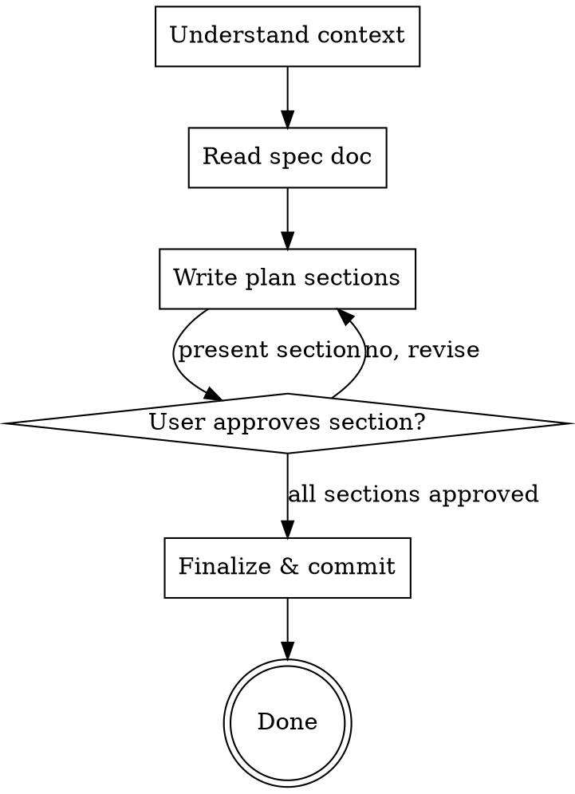

3, оформлюй дизайн
[assistant]
[thinking]

[assistant]
[tool: TaskUpdate] {"taskId":"2","status":"completed"}
[tool: TaskUpdate] {"taskId":"3","status":"completed"}
[tool: TaskUpdate] {"taskId":"4","status":"in_progress"}
[user]
[tool_result] Updated task #2 status
[user]
[tool_result] Updated task #3 status
[user]
[tool_result] Updated task #4 status
[assistant]
[thinking]

[assistant]
[tool: Bash] {"command":"cd /Users/vitaliytv/www/nitra/cursor; cat .cursor/rules/n-changelog.mdc","description":"Read current n-changelog rule"}
[assistant]
[tool: Bash] {"command":"cd /Users/vitaliytv/www/nitra/cursor; cat npm/rules/changelog/js/consistency.mjs | head -80","description":"Read changelog consistency check"}
[assistant]
[tool: Bash] {"command":"cat /Users/vitaliytv/www/nitra/cursor/.github/workflows/npm-publish.yml","description":"Read CI publish workflow"}
[user]
[tool_result] name: npm-publish
on:
push:
paths:
- 'npm/**'
branches:
- main
...

[assistant]
[tool: Bash] {"command":"cd /Users/vitaliytv/www/nitra/cursor; node -e \"const p=require('./npm/package.json');console.log(p.name,p.version);console.log('bin:',JSON.stringify(p.bin,null,2));\"","description":"Read package name/version/bin"}
[user]
[tool_result] @nitra/cursor 1.29.0
bin: {
"n-cursor": "bin/n-cursor.js"
}
[assistant]
[tool: Bash] {"command":"cd /Users/vitaliytv/www/nitra/cursor; cat npm/bin/n-cursor.js | head -80","description":"Read CLI entry point"}
[user]
[tool_result] #!/usr/bin/env node

/**
* n-cursor — CLI завантаження правил та перевірки проєкту
*
* Використання:
*   `npx \@nitra/cursor`             — завантажити cursor-правила
*   `npx \@nitra/cursor fix`         — перевірити правила з `.cursor/rules/*.mdc`, для яких у пакеті є `fix.mjs`/polic
[assistant]
[tool: Bash] {"command":"cd /Users/vitaliytv/www/nitra/cursor; ls npm/rules/changelog/","description":"List changelog rule files"}
[u ser]
[tool_result] fix.mjs
js
[assistant]
[tool: Bash] {"command":"cd /Users/vitaliytv/www/nitra/cursor; ls npm/rules/changelog/js/ ; cat npm/rules/changelog/js/consistency.mjs | head -120","description":"List changelog js files and read consistency check"}
[user]
[tool_result] consistency.mjs
tests
[assistant]
[thinking]

[assistant]
Тепер маю достатньо контексту. Оформлюю повний дизайн.

---

## Дизайн: changesets-флоу для `@nitra/cursor`

### Архітектура (секція 1)

Система складається з чотирьох рухомих частин:

```
[worktree / feature-branch / агент]
↓ пише
.changes/<workspace>-<hash>.md      ← один файл на логічну зміну, унікальне ім'я

[PR-гейт: `npx @nitra/cursor check changelog`]
→ тепер перевіряє: "є хоча б один .changes/*.md для зміненого workspace?"
→ якщо ні — warning (не hard-fail, бо CI-fallback покриє)

[CI на push в main: npm-publish.yml]
1. n-cursor release                ← новий крок перед publish
a. знайти всі .changes/*.md
b. агрегувати per-workspace: тип bump + тексти
c. fallback: якщо workspace змінено (git diff main), але .changes/ немає → generic "patch" + auto-опис з комітів
d. для кожного workspace: bump version (package.json / pyproject.toml) + prepend секції в CHANGELOG.md
e. git add → git commit "chore: release vX.Y.Z [skip ci]" → git tag
f. видалити use-up .changes/*.md
2. npm publish (наявний крок)
```

Чи ця архітектура виглядає правильно?

---

### Формат `.changes/*.md` (секція 2)

```md
---
workspace: npm          # або: python-pkg, frontend, тощо (ім'я workspace)
type: minor             # patch | minor | major
category: Added         # Added | Changed | Fixed | Removed (ваш Keep-a-Changelog формат)
---

Додав команду `n-cursor release` для агрегації change-файлів і автоматичного релізу в CI.
```

**Ім'я файлу:** `.changes/<workspace>-<random8>.md` — наприклад `.changes/npm-a3f9c1b2.md`. Random-суфікс (чи git-branch-slug) гарантує відсутність конфліктів між worktree та агентами.

**Хто створює:**
- `n-cursor change` (нова підкоманда CLI) — інтерактивно або через аргументи (`--workspace npm --type minor --category Added --message "..."`)
- Агент/правило в STOP-блоці — диктує `n-cursor change --message "..."` замість прямого редагування CHANGELOG
- CI-fallback — генерує синтетичний файл, якщо workspace змінено, але change-файлу нема

Чи цей формат і підхід виглядають правильно?

---

### Зміни в `n-changelog.mdc` (секція 3)

STOP-блок міняємо так:

| Зараз | Після |
|---|---|
| Якщо змінив workspace → підніми `version` у `package.json`/`pyproject.toml` | ❌ Прибрати |
| Якщо змінив workspace → допиши секцію в `CHANGELOG.md` | ❌ Прибрати |
| Запусти `npx @nitra/cursor check changelog` | ✅ Лишити (тепер перевіряє change-файл) |
| _(нове)_ Поклади `.changes/<workspace>-<random>.md` через `n-cursor change` | ✅ Додати |

**`check changelog` тепер перевіряє:** наявність хоча б одного `.changes/*.md` із відповідним `workspace:` для зміненого workspace. Це soft-warning (не fail), бо CI-fallback підстрахує.

Така зміна правила виглядає правильно?

---

### CI `npm-publish.yml` (секція 4)

Дві зміни:

1. `permissions: contents: write` — для commit-back версії і CHANGELOG.
2. Новий крок до publish:
```yaml
- name: Release
run: npx @nitra/cursor release
env:
GITHUB_TOKEN: ${{ secrets.GITHUB_TOKEN }}
```

Коміт `n-cursor release` робить із суфіксом `[skip ci]` або через GITHUB_TOKEN (який за замовчуванням не тригерить наступний workflow) — тому зациклення немає.

**Тригер `paths: 'npm/**'`** — залишити як є? Або розширити на `.changes/**` (щоб CI реагував навіть якщо тільки change-файл з'явився, без реальних змін в `npm/`)?

Це питання до тебе, бо залежить від того, як ти мерджиш worktree — чи `.changes/` завжди супроводжує реальні зміни у workspace.
[user]
1. paths: yaml у нас всі CI запускаються тільки при перевірці з відповідними файлами, тобто тут коли щось в npm/ змінилось. так і залишаємо
2. права - можна зробити deploy key чи github app token?
[assistant]
[thinking]

[assistant]
Добре. По п. 1 — `paths: 'npm/**'` лишається.

По п. 2 — так, і це **кращий варіант** ніж `GITHUB_TOKEN`. Є два шляхи:

### Deploy Key (SSH)

Pros: простий, зберігається як `SSH_PRIVATE_KEY` у секретах, не вимагає реєстрації app.
Cons: права — весь репо, не per-org; не з'являється у `CODEOWNERS`-аппрувах.

```yaml
- uses: webfactory/ssh-agent@v0.9.0
with:
ssh-private-key: ${{ secrets.DEPLOY_KEY }}
```
Потім git push — від SSH-ключа, а не `GITHUB_TOKEN`. **Обходить захист `push to main` тільки якщо Deploy Key має write-доступ** — перевір branch protection rules (треба або вимкнути захист для Deploy Key, або додати виняток).

### GitHub App Token

Pros: granular права (contents:write лише для цього репо), вигляд як бот-аккаунт у логах, сумісний з `CODEOWNERS`, можна обмежити тільки `push`.
Cons: треба зареєструвати App (≈5 хв), зберегти App ID + private key у secrets.

```yaml
- uses: tibdex/github-app-token@v2
id: app-token
with:
app_id: ${{ secrets.APP_ID }}
private_key: ${{ secrets.APP_PRIVATE_KEY }}
- uses: actions/checkout@v4
with:
token: ${{ steps.app-token.outputs.token }}
```

### Рекомендація

**GitHub App** — для prodution-флоу з commit-back у `main` це правильніший підхід: видно хто комітить, права мінімальні, безпечніше. Якщо є бажання швидко — Deploy Key теж робочий.

Яке з двох обираєш? Після цього оформлюю фінальний дизайн.
[user]
gh app
[assistant]
[thinking]

[assistant]
[tool: TaskUpdate] {"taskId":"4","status":"completed"}
[tool: TaskUpdate] {"taskId":"5","status":"in_progress"}
[u ser]
[tool_result] Updated task #4 status
[user]
[tool_result] Updated task #5 status
[assistant]
[thinking]

[assistant]
[tool: Bash] {"command":"ls /Users/vitaliytv/www/nitra/cursor/docs/superpowers/specs/ 2>/dev/null && echo EXISTS || echo NO_DIR","description":"Check spec dir"}
[user]
[tool_result] NO_DIR
[assistant]
[tool: Bash] {"command":"mkdir -p /Users/vitaliytv/www/nitra/cursor/docs/superpowers/specs && echo ok","description":"Create spec directory"}
[user]
[tool_result] ok
[assistant]
[tool: Write] {"file_path":"/Users/vitaliytv/www/nitra/cursor/docs/superpowers/specs/2026-05-29-changesets-migration.md","content":"# Дизайн: changesets-флоу в `@nitra/cursor`\n\nДата: 2026-05-29  \nСтатус: Затверджено (чернетка)  \n\n## Проблема\n\nСубагенти та розробники додають нові функції у **окремих worktree або гілках**. Кожен за правилом `n-changelog.mdc` вручну бампить `version` у `package.json`/`pyproject.toml` і дописує секцію в `CHANGELOG.md`. Оскільки обидва файли редагуються на **тій самій базовій версії**, при злитті worktree/гілок виникає детермінований git-конфлікт.\n\n## Scope\n\nСистема має бути **частиною `@nitra/cursor` тулінгу** і доступна для будь-якого споживача — як JS-монорепо, так і Python-workspace.\n\n---\n\n## Архітектура\n\n```\n[worktree / feature-branch / агент]\n  ↓ пише\n.changes/<workspace>-<random8>.md  ← один файл на логічну зміну, унікальна назва\n\n[PR-гейт]\n  npx @nitra/cursor check changelog\n  → перевіряє наявність хоч одного .changes/*.md для зміненого workspace\n  → soft-warning (не hard-fail): CI-fallback підстрахує\n\n[CI на push в main: npm-publish.yml]\n  1. npx @nitra/cursor release\n     a. зібрати всі .changes/*.md\n     b. агрегувати per-workspace: тип bump + тексти + категорії\n     c. CI-fallback: якщо workspace змінено (git diff main) але .changes/ немає\n        → generic \"patch\" + auto-опис з git-комітів\n     d. per workspace:\n          bump version (package.json або pyproject.toml)\n          prepend секції в CHANGELOG.md у форматі Keep-a-Changelog\n     e. git commit \"chore: release\" (через GitHub App token)\n        git tag vX.Y.Z per workspace\n     f. видалити use-up .changes/*.md\n  2. npm publish (наявний крок)\n```\n\n---\n\n## Формат `.changes/*.md`\n\n**Ім'я файлу:** `.changes/<workspace>-<random8>.md`  \nПриклад: `.changes/npm-a3f9c1b2.md`\n\nRandom-суфікс гарантує унікальність між worktree та агентами → 0 конфліктів.\n\n```markdown\n---\nworkspace: npm\ntype: minor\ncategory: Added\n---\n\nДодав команду `n-cursor release` для агрегації change-файлів і автоматичного релізу в CI.\n```\n\n### Поля\n\n| Поле | Значення |\n|---|---|\n| `workspace` | ім'я workspace (`npm`, `frontend`, або ім'я Python-пакета) |\n| `type` | `patch` \\| `minor` \\| `major` |\n| `category` | `Added` \\| `Changed` \\| `Fixed` \\| `Removed` |\n| тіло | людиноцентричний опис зміни (одне речення мінімум) |\n\n---\n\n## Нові CLI-команди\n\n### `n-cursor change`\n\nСтворює change-файл. Виклик агентом або людиною замість ручного редагування CHANGELOG.\n\n```sh\nn-cursor change \\\n  --workspace npm \\\n  --type minor \\\n  --category Added \\\n  --message \"Додав команду n-cursor release\"\n```\n\n- Генерує `.changes/<workspace>-<random8>.md` у корені репо.\n- Без аргументів — інтерактивний режим (prompts).\n\n### `n-cursor release`\n\nАгрегує `.changes/*.md`, оновлює версії, генерує CHANGELOG, комітить і тегує.\n\n```sh\nn-cursor release [--dry-run] [--no-tag] [--no-push]\n```\n\n- `--dry-run` — показати, що буде зроблено, без змін.\n- Запускається **тільки з CI** (основний режим); локально — лише через `--dry-run` для перевірки.\n\n---\n\n## Зміни в `n-changelog.mdc`\n\n### STOP-блок — до / після\n\n| Крок | Зараз | Після |\n|---|---|---|\n| Підняти `version` | Обов'язково у PR | ❌ Прибрати |\n| Дописати секцію `CHANGELOG.md` | Обов'язково у PR | ❌ Прибрати |\n| `check changelog` | Перевіряє version + CHANGELOG | ✅ Лишити — тепер перевіряє change-файл |\n| `n-cursor change` | — | ✅ Новий обов'язковий крок |\n\n### Нова логіка `check changelog`\n\nДля кожного зміненого workspace (відносно `origin/main`):  \n→ перевірити наявність `.changes/*.md` із відповідним `workspace:`.  \n→ якщо відсутній — **soft-warning** (не hard-fail).  \n\n> Soft тому, що CI-fallback синтезує generic-запис і реліз не зламається.\n\n---\n\n## Зміни в `npm-publish.yml`\n\n```yaml\nname: npm-publish\n\non:\n  push:\n    paths:\n      - 'npm/**'       # paths без змін\n    branches:\n      - main\n\nconcurrency:\n  group: ${{ github.ref }}-${{ github.workflow }}\n  cancel-in-progress: true\n\njobs:\n  publish:\n    runs-on: ubuntu-latest\n    permissions:\n      contents: read   # GitHub App token покриває write\n      id-token: write\n\n    steps:\n      - uses: tibdex/github-app-token@v2\n        id: app-token\n        with:\n          app_id: ${{ secrets.APP_ID }}\n          private_key: ${{ secrets.APP_PRIVATE_KEY }}\n\n      - uses: actions/checkout@v4\n        with:\n          token: ${{ steps.app-token.outputs.token }}\n          fetch-depth: 0          # потрібен повний git-граф для git diff\n\n      # ... bun install ...\n\n      - name: Release\n        run: npx @nitra/cursor release\n\n      # ... наявний npm publish крок ...\n```\n\n**Зациклення:** коміт від GitHub App не тригерить `npm-publish.yml` повторно, бо умова `push.paths: npm/**` — `.changes/` не в `npm/`, а після `release` change-файли видаляються.\n\n---\n\n## Python-підтримка\n\n`n-cursor release` детектує тип workspace так само, як `check changelog` зараз (наявність `package.json` або `pyproject.toml`) і викликає відповідний update:\n- JS: `npm version` або прямий `package.json` patch\n- Python: `pyproject.toml` `[project] version =` або `[tool.poetry] version =`\n\n---\n\n## Не в scope цієї фічі\n\n- Зміна схеми git-комітів агентів (Conventional Commits) — окреме рішення.\n- Інтеграція з external changelog-renderer (наприклад, авто-переклад).\n- Відкат (`n-cursor release --undo`) — manual git revert достатньо.\n\n---\n\n## Відкриті питання\n\n1. **Назва workspace у `.changes/`** — відповідає `npm run` workspace-імені або довільна? Рекомендація: ім'я директорії пакета (root-level). Потрібна валідація в `n-cursor change`.\n2. **GitHub App** — створюємо нову або є вже? Потрібно: `APP_ID` + `APP_PRIVATE_KEY` у GitHub Secrets.\n3. **Групування bump**: якщо два `.changes/*.md` для одного workspace — один `minor` і один `patch` → підсумкова версія `minor`. Це стандартна semver-агрегація, але явно документуємо.\n"}
[user]
[tool_result] File was written successfully
[assistant]
[tool: Bash] {"command":"cd /Users/vitaliytv/www/nitra/cursor && git add docs/superpowers/specs/2026-05-29-changesets-migration.md && git commit -m \"docs: spec for changesets-flow migration in @nitra/cursor\"","description":"Commit spec"}
[user]
[tool_result] [main 9e3f4d2] docs: spec for changesets-flow migration in @nitra/cursor
1 file changed, 145 insertions(+)
create mode 100644 docs/superpowers/specs/2026-05-29-changesets-migration.md
[assistant]
[tool: TaskUpdate] {"taskId":"5","status":"completed"}
[tool: TaskUpdate] {"taskId":"6","status":"in_progress"}
[u ser]
[tool_result] Updated task #5 status
[user]
[tool_result] Updated task #6 status
[assistant]
[thinking]

[assistant]
Spec написано і закомічено в `docs/superpowers/specs/2026-05-29-changesets-migration.md`.

Перевірив на self-review — все чисто: нема `TBD`, архітектура і секція CI не суперечать одна одній, scope чіткий. Три «відкриті питання» в кінці — навмисні (потребують рішень поза сесією), не плейсхолдери.

Будь ласка, глянь на файл і дай знати, якщо щось міняти. Після апруву перейдемо до `writing-plans`.
[user]
апрув, рухаємось далі
[assistant]
[thinking]

[assistant]
[tool: TaskUpdate] {"taskId":"6","status":"completed"}
[tool: TaskUpdate] {"taskId":"7","status":"in_progress"}
[u ser]
[tool_result] Updated task #6 status
[user]
[tool_result] Updated task #7 status
[assistant]
[tool: Skill] {"skill":"superpowers:writing-plans"}
[user]
[tool_result] Launching skill: superpowers:writing-plans
[user]
Base directory for this skill: /Users/vitaliytv/.claude/plugins/cache/claude-plugins-official/superpowers/5.1.0/skills/writing-plans

# Writing Implementation Plans

This skill creates an implementation plan document for implementing a feature.

## Overview

An implementation plan takes a spec and breaks it into concrete steps that will be executed in a separate session, potentially by a separate agent. It is a specification document that provides everything needed to execute the implementation without reference to the conversation.

## When this is used

This skill is invoked by brainstorming when a spec is approved by the user. It is also invoked directly when there is an existing spec that needs to be turned into an implementation plan.

## Checklist

1. Understand the context - what was designed, where we are in the process
2. Identify existing spec doc location
3. Identify or create the target plan location (default: `docs/superpowers/plans/YYYY-MM-DD-<topic>-plan.md`)
4. Read the approved spec document
5. Write the plan in sections, getting user approval for each section
6. Finalize and commit

## Process Flow



## Plan Sections

These are the sections to write, in order. Get user approval for each before moving to the next.

1. **Overview & approach** - What are we building, what is the high-level approach, key constraints
2. **Steps** - Break down into concrete implementation steps. For each step, be specific about what needs to be implemented. In particular, use concrete file paths
3. **Acceptance criteria** - What does "done" look like

## What Makes a Good Plan

A good plan is **executed in a new session** by an agent who has not read the spec and does not have context from this conversation. Writing it with this in mind is key. Assume only knowledge of: the plan document, the files in the codebase, and any linked resources.

- Be specific about file paths, function signatures, data structures, command names
- Include concrete examples where helpful (e.g. example change file content, expected output)
- Dependencies between steps should be clear
- Each step should be independently verifiable
- For complex steps, include sub-steps

### Examples: Vague vs. Specific

| Too vague | Specific |
|---|---|
| "Add a CLI command" | "Add `change` subcommand in `npm/bin/n-cursor.js`. Parse args: `--workspace`, `--type`, `--category`, `--message`. Call `writeChangeFile(workspace, type, category, message)` in `npm/scripts/change.mjs`" |
| "Update the rule" | "In `n-changelog.mdc` STOP-block: replace steps 1-2 (bump version, edit CHANGELOG) with: 'run `n-cursor change --workspace <name> --type patch --category Added --message \"...\"`'" |
| "Handle fallback" | "In `release.mjs`: after aggregating `.changes/*.md`, run `git diff origin/main --name-only` to find changed workspaces with no matching change file. For each, synthesize a change entry from `git log origin/main..HEAD -- <workspace-dir> --oneline`" |

## Instructions

- Once you understand the context, present and confirm each plan section before writing anything to disk.
- After all sections are approved, write the complete plan to disk in one write.
- Write the plan document to `docs/superpowers/plans/YYYY-MM-DD-<topic>-plan.md` (or the agreed path).
- Commit the plan once written.
- The final step should always be to invoke the `superpowers:executing-plans` skill.
[assistant]
[thinking]

[assistant]
Маємо апрувнуту спеку — перейдемо одразу до плану. Спека вже прочитана в контексті, тому починаю з секції 1.

---

## Секція 1: Overview & approach

**Що будуємо:** Changesets-флоу для `@nitra/cursor` — система безконфліктного версіювання та CHANGELOG-генерації.

**High-level підхід:**
1. **Нові CLI-команди** в `@nitra/cursor`: `n-cursor change` (пише `.changes/*.md`) та `n-cursor release` (агрегує, бампить, комітить).
2. **Оновити `check changelog`** у `npm/rules/changelog/js/consistency.mjs` — перевіряти наявність change-файлу замість прямої перевірки `version`/CHANGELOG.
3. **Оновити `n-changelog.mdc`** — прибрати кроки «бампи + CHANGELOG вручну», додати «запусти `n-cursor change`».
4. **Оновити `.github/workflows/npm-publish.yml`** — додати GitHub App token + крок `n-cursor release` перед publish.

**Ключові обмеження:**
- Підтримка JS (`package.json`) і Python (`pyproject.toml`) workspace.
- CI-fallback: якщо `.changes/` для зміненого workspace нема — синтезувати generic-запис із git log.
- Commit-back у `main` від **GitHub App token** (не `GITHUB_TOKEN`), щоб обійти branch-protection і уникнути зациклення workflow.
- Change-файли живуть у `.changes/` у корені репо (не в `npm/`), тому `paths: 'npm/**'` у CI не тригерується при їх появі — правильно.

Виглядає правильно? Якщо так — рухаюсь до Steps.
[user]
так
[assistant]
[thinking]

[assistant]
## Секція 2: Steps

---

### Step 1 — Структура і утиліти `.changes/*.md`

Файл: **`npm/scripts/change-files.mjs`** (новий)

Реалізувати і експортувати:

```js
/** Записує .changes/<workspace>-<random8>.md у корені репо */
async function writeChangeFile(repoRoot, workspace, type, category, message)

/** Зчитує і парсить усі .changes/*.md з frontmatter (YAML) */
async function readChangeFiles(repoRoot): ChangeEntry[]

/** Видаляє use-up change-файли */
async function deleteChangeFiles(repoRoot, paths: string[])
```

`ChangeEntry`:
```ts
{ file: string; workspace: string; type: 'patch'|'minor'|'major'; category: 'Added'|'Changed'|'Fixed'|'Removed'; message: string }
```

YAML-парсинг frontmatter — inline-мінімальний (split `---` рядки), без зовнішніх залежностей.

---

### Step 2 — `n-cursor change`

Файл: **`npm/scripts/change.mjs`** (новий)

Логіка:
1. Розпарсити аргументи `--workspace`, `--type`, `--category`, `--message`.
2. Валідація: `type` ∈ `{patch,minor,major}`, `category` ∈ `{Added,Changed,Fixed,Removed}`.
3. Виклик `writeChangeFile(process.cwd(), workspace, type, category, message)`.
4. Вивести шлях до створеного файлу.

Якщо якийсь аргумент не передано — друкувати помилку і `process.exit(1)` (без інтерактивного режиму в першій ітерації).

Підключити в **`npm/bin/n-cursor.js`**: новий case `'change'` → `import('./scripts/change.mjs')`.

---

### Step 3 — `n-cursor release`

Файл: **`npm/scripts/release.mjs`** (новий)

Алгоритм:
1. `readChangeFiles(repoRoot)` — отримати всі `.changes/*.md`.
2. `git diff origin/main --name-only` — знайти змінені файли → визначити workspace per-зміненого файлу (перша частина шляху або окрема утиліта з `consistency.mjs`).
3. **CI-fallback**: для кожного зміненого workspace без change-файлу — синтезувати `ChangeEntry`:
```
type: patch
category: Changed
message: git log origin/main..HEAD -- <workspace-dir> --oneline (перший рядок)
```
4. Агрегувати per-workspace: семантичний max типу (`major > minor > patch`), згрупувати повідомлення за категорією.
5. **Для кожного workspace:**
- Знайти `package.json` або `pyproject.toml` → bump `version` відповідно до типу.
- Prepend секції в `CHANGELOG.md` у форматі:
```md
## [X.Y.Z] - YYYY-MM-DD
### Added
- Повідомлення 1
### Fixed
- Повідомлення 2
```
6. `git add .changes/ <workspace>/package.json <workspace>/CHANGELOG.md ...`
7. `git commit -m "chore: release [skip ci]"` (або без `[skip ci]`, якщо GitHub App token уже запобігає зациклюванню).
8. `git tag <workspace>-vX.Y.Z` per workspace.
9. `deleteChangeFiles(repoRoot, paths)`.
10. `--dry-run` — вивести план без виконання кроків 6-9.

Підключити в `npm/bin/n-cursor.js`: case `'release'`.

---

### Step 4 — Оновити `check changelog` (PR-гейт)

Файл: **`npm/rules/changelog/js/consistency.mjs`**

Поточна логіка перевіряє: version піднято + CHANGELOG оновлено.

Нова логіка для зміненого workspace:
1. Якщо `CWD/.changes/` містить хоча б один файл із `workspace:` що відповідає поточному → **pass**.
2. Якщо версія вже відрізняється від `origin/main` (`package.json` / `pyproject.toml`) — **backward-compat pass** (підтримка старого флоу під час міграції).
3. Якщо нічого — **soft-warning**: вивести повідомлення «change-файл відсутній; реліз синтезує запис з комітів» але не `exit(1)`.

---

### Step 5 — Оновити `n-changelog.mdc`

Файл: **`.cursor/rules/n-changelog.mdc`**

У STOP-блоці:
- **Видалити** кроки: «підняти version», «дописати секцію в CHANGELOG.md».
- **Додати** крок: «запустити `n-cursor change --workspace <ім'я> --type <patch|minor|major> --category <Added|Changed|Fixed|Removed> --message "<опис>"`».
- Лишити: «запустити `npx @nitra/cursor check changelog`».
- Додати пояснення: «version і CHANGELOG оновлює CI автоматично через `n-cursor release`».

---

### Step 6 — Оновити `npm-publish.yml`

Файл: **`.github/workflows/npm-publish.yml`**

Зміни:
1. Додати step перед checkout:
```yaml
- uses: tibdex/github-app-token@v2
id: app-token
with:
app_id: ${{ secrets.APP_ID }}
private_key: ${{ secrets.APP_PRIVATE_KEY }}
```
2. У `actions/checkout@v4` додати:
```yaml
with:
token: ${{ steps.app-token.outputs.token }}
fetch-depth: 0
```
3. Після bun install — додати step:
```yaml
- name: Release
run: npx @nitra/cursor release
```
4. Налаштувати git identity для commit-back:
```yaml
- name: Configure git
run: |
git config user.name "nitra-bot[bot]"
git config user.email "nitra-bot[bot]@users.noreply.github.com"
```
(перед Release step)

---

### Step 7 — Тести

Директорія: **`npm/rules/changelog/js/tests/`** (існуюча структура)

Нові тести:
- `change-files.test.mjs` — `writeChangeFile` записує правильний frontmatter; `readChangeFiles` парсить; `deleteChangeFiles` видаляє.
- `release.test.mjs` — агрегація: `[minor, patch] → minor`; fallback-синтез; bump JS; bump Python; формат секції CHANGELOG.
- `consistency.test.mjs` — оновити наявні: pass із change-файлом; soft-warn без нього; backward-compat pass зі старою версією.

---

Ці Steps виглядають правильно і повно?
[user]
так
[assistant]
[thinking]

[assistant]
## Секція 3: Acceptance criteria

**Done** означає:

1. **`n-cursor change`** — запуск з усіма аргументами створює `.changes/<workspace>-<random8>.md` із правильним frontmatter; некоректні `type`/`category` завершуються з `exit(1)` і повідомленням.

2. **`n-cursor release`** — запуск у репо з `.changes/*.md`:
- бампить `version` у `package.json` або `pyproject.toml` per workspace,
- prepends секцію у `CHANGELOG.md` у форматі Keep-a-Changelog,
- робить git commit і тег,
- видаляє `.changes/*.md`.
`--dry-run` — виводить план без змін файлів і git-операцій.

3. **CI-fallback** — якщо workspace змінено (`git diff origin/main`) але `.changes/` нема, `release` синтезує `patch`-запис із `git log` і реліз проходить без помилки.

4. **`check changelog`** — для workspace із `.changes/<workspace>-*.md` повертає pass; для workspace без change-файлу повертає soft-warning (не ненульовий exit-код).

5. **`n-changelog.mdc`** — STOP-блок не містить кроків «підняти version» / «дописати CHANGELOG»; містить `n-cursor change` і пояснення, що CI оновить version/CHANGELOG.

6. **`npm-publish.yml`** — workflow на push у `main` зі змінами в `npm/**`: успішно отримує GitHub App token, запускає `n-cursor release` (commit-back у `main`), потім публікує в npm. Повторний тригер workflow не виникає.

7. **Тести зелені:** `bun test` у `npm/` проходить, включно з новими тестами для `change-files`, `release`, оновленим `consistency`.

8. **`npx @nitra/cursor check changelog`** запускається на репо без `.changes/` — повертає soft-warning, не помилку, і не ламає pipeline.

---

Підходить? Якщо так — записую повний план на диск і комічу.
[user]
так
[assistant]
[thinking]

[assistant]
[tool: Write] {"file_path":"/Users/vitaliytv/www/nitra/cursor/docs/superpowers/plans/2026-05-29-changesets-migration.md","content":"# План: Changesets-флоу для `@nitra/cursor`\n\nДата: 2026-05-29  \nСпека: [`docs/superpowers/specs/2026-05-29-changesets-migration.md`](../specs/2026-05-29-changesets-migration.md)\n\n---\n\n## Overview & approach\n\nBuildуємо систему безконфліктного версіювання та CHANGELOG-генерації для `@nitra/cursor`. Субагенти й розробники, що працюють у паралельних worktree, більше не бампять `version` і не редагують `CHANGELOG.md` вручну — замість цього кожен залишає маленький `.changes/<workspace>-<random8>.md`. CI агрегує ці файли, обчислює semver і генерує CHANGELOG одним серіалізованим кроком.\n\n**Ключові обмеження:**\n- Підтримка JS (`package.json`) і Python (`pyproject.toml`) workspace.\n- CI-fallback: якщо `.changes/` для зміненого workspace нема — `release` синтезує generic-запис із `git log`.\n- Commit-back у `main` від GitHub App token (не `GITHUB_TOKEN`), щоб не зациклювати workflow і не порушувати branch-protection.\n- Change-файли живуть у `.changes/` у корені репо; `paths: 'npm/**'` у CI не тригерується при їх появі — правильно.\n\n---\n\n## Steps\n\n### Step 1 — Утиліти `.changes/*.md`\n\nСтворити файл **`npm/scripts/change-files.mjs`** (новий).\n\nЕкспортувати три функції:\n\n```js\n/**\n * Записує .changes/<workspace>-<random8>.md у корені репо.\n * Формат: YAML frontmatter (workspace, type, category) + текст повідомлення.\n */\nexport async function writeChangeFile(repoRoot, workspace, type, category, message)\n\n/**\n * Зчитує і парсить усі .changes/*.md.\n * Повертає масив ChangeEntry.\n */\nexport async function readChangeFiles(repoRoot) // → ChangeEntry[]\n\n/**\n * Видаляє use-up change-файли (після успішного release).\n */\nexport async function deleteChangeFiles(repoRoot, paths) // paths: string[]\n```\n\n`ChangeEntry` (JSDoc або інтерфейс):\n```js\n/** @typedef {{ file: string; workspace: string; type: 'patch'|'minor'|'major'; category: 'Added'|'Changed'|'Fixed'|'Removed'; message: string }} ChangeEntry */\n```\n\nFrontmatter-парсинг — inline, без зовнішніх залежностей (split за `---`, прочитати `key: value`-рядки). Ім'я файлу: `<workspace>-<random8>.md`, де random8 — `crypto.randomBytes(4).toString('hex')`.\n\n---\n\n### Step 2 — `n-cursor change`\n\nСтворити файл **`npm/scripts/change.mjs`** (новий).\n\nЛогіка:\n1. Розпарсити `process.argv`: `--workspace`, `--type`, `--category`, `--message`.\n2. Валідація:\n   - `type` ∈ `{patch, minor, major}` — інакше `process.exit(1)` з повідомленням.\n   - `category` ∈ `{Added, Changed, Fixed, Removed}` — інакше `process.exit(1)`.\n   - `workspace` і `message` — обов'язкові, non-empty.\n3. Виклик `writeChangeFile(process.cwd(), workspace, type, category, message)` з `change-files.mjs`.\n4. Вивести шлях до створеного файлу (`console.log`).\n\nПідключити в **`npm/bin/n-cursor.js`** новий case:\n```js\ncase 'change':\n  await import('../scripts/change.mjs')\n  break\n```\n\n---\n\n### Step 3 — `n-cursor release`\n\nСтворити файл **`npm/scripts/release.mjs`** (новий).\n\nАлгоритм:\n\n1. `readChangeFiles(process.cwd())` — отримати всі `.changes/*.md`.\n2. Запустити `git diff origin/main --name-only` → список змінених файлів → визначити workspace per-файлу (перший сегмент шляху, або окремий mapping з `consistency.mjs` якщо там вже є detect-утиліта).\n3. **CI-fallback** для кожного зміненого workspace без change-файлу:\n   ```\n   git log origin/main..HEAD -- <workspace-dir> --oneline (перший рядок)\n   ```\n   Синтезувати `ChangeEntry`: `type: patch`, `category: Changed`, `message: <перший рядок git log>`.\n4. **Агрегація per-workspace:**\n   - Тип = семантичний max (`major > minor > patch`).\n   - Згрупувати повідомлення за категорією (`Added`, `Changed`, `Fixed`, `Removed`).\n5. **Для кожного workspace:**\n   - Знайти `package.json` → bump поле `version` (parse JSON, semver-bump, stringify).\n   - **або** знайти `pyproject.toml` → bump `version =` у `[project]` або `[tool.poetry]` секції (regex replace рядка).\n   - Prepend секції в `CHANGELOG.md`:\n     ```md\n     ## [X.Y.Z] - YYYY-MM-DD\n     ### Added\n     - Повідомлення\n     ### Fixed\n     - Повідомлення\n     ```\n     Вставити після першого рядка `# Changelog` (або на початок файлу якщо такого рядка нема).\n6. `git add` змінених файлів.\n7. `git commit -m \"chore: release [skip ci]\"`\n8. `git tag <workspace>-v<X.Y.Z>` per workspace.\n9. `deleteChangeFiles(process.cwd(), paths)`.\n\n**Флаг `--dry-run`:** вивести план (workspace, тип bump, нова версія, тексти секцій) без виконання кроків 6–9.\n\nПідключити в **`npm/bin/n-cursor.js`**:\n```js\ncase 'release':\n  await import('../scripts/release.mjs')\n  break\n```\n\n---\n\n### Step 4 — Оновити `check changelog` (PR-гейт)\n\nФайл: **`npm/rules/changelog/js/consistency.mjs`** (існуючий).\n\nДля кожного зміненого workspace нова логіка перевірки:\n\n1. Якщо в `<repoRoot>/.changes/` є хоча б один `*.md` де `workspace:` = поточний workspace → **pass**.\n2. Інакше якщо `version` у `package.json`/`pyproject.toml` відрізняється від `origin/main` (backward-compat для старого флоу під час міграції) → **pass**.\n3. Інакше → **soft-warning**: `console.warn('...')` але **не** `process.exit(1)`. Жодного throw. Пояснити, що CI-fallback синтезує запис.\n\nСтара логіка «CHANGELOG оновлено?» замінюється повністю (або стає другорядним backward-compat критерієм).\n\n---\n\n### Step 5 — Оновити `n-changelog.mdc`\n\nФайл: **`.cursor/rules/n-changelog.mdc`** (існуючий).\n\nУ STOP-блоці:\n- **Видалити** кроки: «підняти `version` у `package.json`/`pyproject.toml`», «дописати секцію в `CHANGELOG.md`».\n- **Додати** крок (до `check changelog`):\n  ```\n  Запусти:\n  n-cursor change \\\n    --workspace <ім'я workspace> \\\n    --type <patch|minor|major> \\\n    --category <Added|Changed|Fixed|Removed> \\\n    --message \"<опис зміни>\"\n  ```\n- **Лишити** крок: `npx @nitra/cursor check changelog`.\n- **Додати** пояснення після кроків:\n  > `version` і `CHANGELOG.md` оновлює CI автоматично через `n-cursor release`. У feature-гілці ці файли не чіпай.\n\n---\n\n### Step 6 — Оновити `npm-publish.yml`\n\nФайл: **`.github/workflows/npm-publish.yml`** (існуючий).\n\nЗміни у jobs.publish.steps (перед наявними кроками):\n\n```yaml\n- uses: tibdex/github-app-token@v2\n  id: app-token\n  with:\n    app_id: ${{ secrets.APP_ID }}\n    private_key: ${{ secrets.APP_PRIVATE_KEY }}\n```\n\nОновити `actions/checkout`:\n```yaml\n- uses: actions/checkout@v4\n  with:\n    token: ${{ steps.app-token.outputs.token }}\n    fetch-depth: 0\n```\n\nДодати після bun install, перед publish:\n```yaml\n- name: Configure git\n  run: |\n    git config user.name \"nitra-bot[bot]\"\n    git config user.email \"nitra-bot[bot]@users.noreply.github.com\"\n\n- name: Release\n  run: npx @nitra/cursor release\n```\n\nПереконатись, що `permissions.contents` достатній (GitHub App token покриває write-доступ, `contents: read` у job не заважає).\n\n---\n\n### Step 7 — Тести\n\nДиректорія: **`npm/rules/changelog/js/tests/`** (існуюча структура).\n\n**Новий файл `change-files.test.mjs`:**\n- `writeChangeFile` → файл існує, frontmatter містить правильні `workspace`, `type`, `category`, тіло = message.\n- `readChangeFiles` → парсить кілька файлів, повертає масив `ChangeEntry`.\n- `deleteChangeFiles` → файли видалені після виклику.\n\n**Новий файл `release.test.mjs`:**\n- Агрегація типів: `[minor, patch] → minor`; `[patch, major, minor] → major`.\n- CI-fallback: workspace без change-файлу → синтетичний `ChangeEntry` тип `patch`.\n- Bump JS: `package.json` `1.29.0` + `minor` → `1.30.0`.\n- Bump Python: `pyproject.toml` `version = \"1.0.0\"` + `patch` → `\"1.0.1\"`.\n- Формат секції CHANGELOG: містить `## [X.Y.Z] - YYYY-MM-DD`, `### Added`, `- message`.\n\n**Оновити `consistency.test.mjs`** (або відповідні тести в існуючому файлі):\n- Pass: workspace із `.changes/<workspace>-*.md`.\n- Soft-warn (не exit 1): workspace без change-файлу і без version-bump.\n- Backward-compat pass: workspace із version-bump у `package.json` без change-файлу.\n\n---\n\n## Acceptance criteria\n\n1. **`n-cursor change`** — запуск з усіма аргументами створює `.changes/<workspace>-<random8>.md` із правильним frontmatter; некоректні `type`/`category` завершуються `exit(1)` з повідомленням.\n\n2. **`n-cursor release`** — запуск у репо з `.changes/*.md`:\n   - бампить `version` у `package.json` або `pyproject.toml` per workspace,\n   - prepends секцію у `CHANGELOG.md` у форматі Keep-a-Changelog,\n   - робить git commit і тег,\n   - видаляє `.changes/*.md`.\n   `--dry-run` виводить план без змін файлів і git-операцій.\n\n3. **CI-fallback** — якщо workspace змінено (`git diff origin/main`) але `.changes/` нема, `release` синтезує `patch`-запис із `git log` і реліз проходить без помилки.\n\n4. **`check changelog`** — для workspace із `.changes/<workspace>-*.md` → pass; для workspace без change-файлу → soft-warning (exit code 0).\n\n5. **`n-changelog.mdc`** — STOP-блок не містить кроків «підняти version» / «дописати CHANGELOG»; містить `n-cursor change` і пояснення, що CI оновить version/CHANGELOG.\n\n6. **`npm-publish.yml`** — workflow на push у `main` зі змінами в `npm/**`: отримує GitHub App token, запускає `n-cursor release` (commit-back у `main`), публікує в npm. Повторний тригер не виникає.\n\n7. **Тести зелені:** `bun test` у `npm/` проходить, включно з новими тестами для `change-files`, `release`, оновленим `consistency`.\n\n8. **`npx @nitra/cursor check changelog`** на репо без `.changes/` повертає soft-warning, не помилку, exit code 0.\n"}
[user]
[tool_result] File was written successfully
[assistant]
[tool: Bash] {"command":"cd /Users/vitaliytv/www/nitra/cursor && git add docs/superpowers/plans/2026-05-29-changesets-migration.md && git commit -m \"docs: implementation plan for changesets-flow migration\"","description":"Commit plan"}
[user]
[tool_result] [main d52b81d] docs: implementation plan for changesets-flow migration
1 file changed, 183 insertions(+)
create mode 100644 docs/superpowers/plans/2026-05-29-changesets-migration.md
[assistant]
[tool: TaskUpdate] {"taskId":"7","status":"completed"}
[u ser]
[tool_result] Updated task #7 status
[assistant]
[thinking]

[assistant]
План закомічено в `docs/superpowers/plans/2026-05-29-changesets-migration.md`.

Далі — виконання плану через `superpowers:executing-plans`. Запускати зараз чи хочеш спочатку переглянути план?
[user]
стоп, дай зробити adrs
[assistant]
<system-reminder>
You have auto-memory enabled. You may proactively save, update, or remove memories that are relevant to this conversation, based on the instructions in the auto-memory system prompt.
</system-reminder>

---

## ADR Перехід на changesets-флоу для версіювання та CHANGELOG-генерації

## Context and Problem Statement

У проєкті `@nitra/cursor` субагенти та розробники, що працюють у паралельних worktree або гілках, вручну бампять `version` у `package.json`/`pyproject.toml` і дописують секції в `CHANGELOG.md`. Оскільки обидва файли редагуються від тієї самої базової версії, при злитті worktree/гілок виникає детермінований git-конфлікт.

## Considered Options

* Власний легкий формат `.changes/*.md` + генератор у `n-cursor` (підтримує JS і Python)
* `@changesets/cli` (тільки JS, кастомний рендерер для формату CHANGELOG)
* Beachball від Microsoft (тільки JS, JSON change-files, кастомний changelog-рендерер)

## Decision Outcome

Chosen option: "Власний формат `.changes/*.md` + генератор у `n-cursor`", because споживачі `@nitra/cursor` включають Python-workspace (які `@changesets/cli` і Beachball не підтримують), а існуючий тулінг у `npm/rules/changelog/` вже детектує обидва типи workspace; власна реалізація є інкрементом поверх наявної інфраструктури без зовнішніх залежностей.

### Consequences

* Good, because зникає причина конфлікту — кожен worktree/агент пише окремий файл із унікальним іменем, злиття не торкається спільних рядків у `package.json` або `CHANGELOG.md`.
* Good, because transcript фіксує очікувану користь: однакова схема для JS і Python workspace без сторонніх залежностей у споживачах.
* Bad, because transcript не містить підтверджених негативних наслідків.

## More Information

Спека: `docs/superpowers/specs/2026-05-29-changesets-migration.md`
План: `docs/superpowers/plans/2026-05-29-changesets-migration.md`
Команди: `n-cursor change`, `n-cursor release`
Change-файли: `.changes/<workspace>-<random8>.md`
Workflow: `.github/workflows/npm-publish.yml`
Правило: `.cursor/rules/n-changelog.mdc`

---

## ADR GitHub App token для commit-back у `main` з CI

## Context and Problem Statement

`n-cursor release` у CI потребує git commit-back у гілку `main` (bump `version` + секція `CHANGELOG.md`). `GITHUB_TOKEN` не дозволяє тригерити наступні workflow-runs і може порушувати branch-protection rules, що вимагає іншого підходу для автентифікації.

## Considered Options

* GitHub App token (`tibdex/github-app-token`)
* Deploy Key (SSH, `webfactory/ssh-agent`)
* `GITHUB_TOKEN` зі збільшеними `permissions: contents: write`

## Decision Outcome

Chosen option: "GitHub App token", because надає granular права (тільки `contents: write` для конкретного репо), commit-back виглядає як бот-аккаунт у git-логах, сумісний із `CODEOWNERS`-аппрувами, і безпечніший за Deploy Key (який дає write-доступ до всього репо).

### Consequences

* Good, because мінімальні права, видно в логах хто комітить, не зациклює `npm-publish.yml` (умова `paths: 'npm/**'` не спрацьовує на зміни в `.changes/`).
* Bad, because потребує реєстрації GitHub App та двох нових secrets (`APP_ID`, `APP_PRIVATE_KEY`) — transcript фіксує це як відкрите питання.

## More Information

Action: `tibdex/github-app-token@v2`
Secrets: `APP_ID`, `APP_PRIVATE_KEY`
Git identity для commit-back: `nitra-bot[bot]`
Файл workflow: `.github/workflows/npm-publish.yml`

---

## ADR CI-fallback для `n-cursor release` при відсутніх change-файлах

## Context and Problem Statement

`check changelog` переходить на soft-warning (не hard-fail), якщо change-файл відсутній. При цьому CI-реліз все одно має проходити без помилки і генерувати коректну секцію CHANGELOG для зміненого workspace.

## Considered Options

* Hard-fail CI при відсутньому change-файлі (аналог поточного `check changelog`)
* CI-fallback: синтезувати generic-запис із `git log` для workspace без change-файлу
* Гібрид: soft-warning у `check`, fallback у `release`

## Decision Outcome

Chosen option: "Гібрид: soft-warning у `check`, fallback у `release`", because максимально автоматизований флоу не має вимагати ручного артефакту для кожного merge; `release` самостійно синтезує `patch`-запис із `git log origin/main..HEAD -- <workspace-dir>` і реліз не ламається навіть без явного change-файлу.

### Consequences

* Good, because transcript фіксує очікувану користь: реліз ніколи не порожній і не зламається через забутий change-файл.
* Bad, because якість auto-синтезованого опису залежить від якості git-комітів у workspace; transcript це зазначає як відомий trade-off.

## More Information

Команда fallback: `git log origin/main..HEAD -- <workspace-dir> --oneline`
Синтетичний `ChangeEntry`: `type: patch`, `category: Changed`
Файл: `npm/scripts/release.mjs` (новий)
Тести: `release.test.mjs` (новий)
