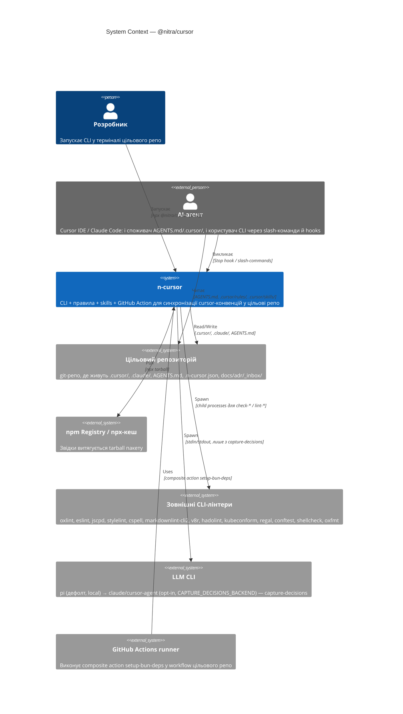

# CI4 / L1 — System Context

Зовнішні актори і системи, з якими взаємодіє пакет [`@nitra/cursor`](../../npm/package.json). Сам пакет — `n-cursor` — представлений як єдина система; внутрішня структура розкривається на [L2 (Containers)](02-containers.md).

## Діаграма

## Актори і зовнішні системи

### Розробник

Інженер у команді цільового проєкту. Запускає `npx @nitra/cursor` (синк правил), `npx @nitra/cursor check` (programmatic-перевірки) і використовує slash-команди (`/n-fix`, `/n-lint`, `/n-publish-telegram`, `/n-llm-patch`, `/n-taze`, `/mdc-check`) у Cursor / Claude Code.

### AI-агент

Cursor IDE та Claude Code. Виступає у двох ролях:

- **Споживач артефактів** — читає [`AGENTS.md`](../../AGENTS.md), `.cursor/rules/n-*.mdc`, `.cursor/skills/n-*/`. Це формує його поведінку перед редагуванням коду.
- **Користувач CLI** — викликає `n-cursor stop-hook` через `.claude/settings.json`, читає AGENTS-команди як підказки до запуску `bun run lint` / `bun run test` тощо.

### Цільовий репозиторій

Git-репо, у яке встановлюється `@nitra/cursor`. CLI керовано перезаписує:

- `.cursor/rules/n-*.mdc` — правила (managed)
- `.cursor/skills/n-*/` — skills (managed)
- `.claude/commands/` — slash-команди (managed)
- `.claude/settings.json` — секції `hooks` і `permissions` (merge, не перезапис)
- `.claude/hooks/capture-decisions.sh` — bash-хук (overwrite)
- `AGENTS.md` — повний перезапис з [`AGENTS.template.md`](../../npm/AGENTS.template.md)
- `.n-cursor.json` — створюється/оновлюється `$schema` і сортуються масиви
- `package.json` — додається `@nitra/cursor` у `devDependencies`, якщо немає

CLI **не торкається** користувацького коду, інших `.mdc`, інших hook-груп у `settings.json`. Ідентифікація managed-блоків — за маркерами в `command`.

### npm Registry / npx-кеш

Tarball пакету розпаковується в кеш npx або в `node_modules/@nitra/cursor` цільового репо. Усі шаблони, правила, скрипти й JSON-схеми — звідти. Окремих HTTP-запитів до CDN під час роботи CLI немає.

### Зовнішні CLI-лінтери

`n-cursor check <rule>` запускає `check-*.mjs`, які або реалізують власну логіку, або spawn-ять зовнішній CLI:

| Лінтер                               | Використовується в                          |
| ------------------------------------ | ------------------------------------------- |
| `oxlint`, `eslint`, `jscpd`          | `check-js-lint`, root `lint-js` script      |
| `stylelint`                          | root `lint-style`                           |
| `cspell`, `markdownlint-cli2`, `v8r` | `check-text`, root `lint-text`              |
| `hadolint`                           | `utils/docker-hadolint.mjs`, `check-docker` |
| `kubeconform`                        | `run-k8s.mjs`                               |
| `regal`, `conftest`                  | `lint-rego.mjs`, `lint-conftest.mjs`        |
| `shellcheck`                         | `run-shellcheck-text.mjs`                   |
| `oxfmt`                              | root `lint` (форматування)                  |
| `github-actionlint`, `zizmor`        | `lint-ga.mjs`                               |

Усі — зовнішні бінарники, які `n-cursor` лише викликає. Якщо бінарника немає в `PATH` — чекає або пропускає (`opa`/`conftest`/`shellcheck` — soft-skip; `oxlint`/`eslint` — hard-fail).

### LLM CLI

Тільки в `cnt-capture-decisions` (Stop-hook, який пише ADR-чернетки). Бекенд обирається селектором `CAPTURE_DECISIONS_BACKEND` (дефолт `pi`, spec `2026-06-30`):

1. `pi` (дефолт) — локальний `pi` (npm-first lookup: root `.bin` → nested `@nitra/cursor` `.bin` → `PATH`), герметичний офлайн-виклик `--no-session --mode text --no-tools --no-context-files --no-extensions --no-skills --no-prompt-templates --offline --model "$CAPTURE_DECISIONS_PI_MODEL"` (модель — `CAPTURE_DECISIONS_PI_MODEL` або канон `N_LOCAL_MIN_MODEL`); без бінарника/моделі — `exit 0` без переходу на cloud-бекенд.
2. `claude` — примусово `claude -p --model "$CAPTURE_DECISIONS_CLAUDE_MODEL"` (default `sonnet`), якщо `CAPTURE_DECISIONS_BACKEND=claude`.
3. `cursor-agent` — примусово `cursor-agent -p --mode ask --output-format text --model "$CAPTURE_DECISIONS_CURSOR_MODEL"` (default `claude-4.6-sonnet-medium`), якщо `CAPTURE_DECISIONS_BACKEND=cursor-agent`.
4. `auto` — каскад за доступністю `pi` → `claude` → `cursor-agent` → skip (не за результатом виклику: порожня відповідь обраного бекенду фінальна, без каскаду).

`ADR_HOOKS_SKIP=1` (виставляється `npm/bin/n-cursor.js` перед CLI `switch` для будь-якої підкоманди-оркестратора) змушує і `capture-decisions.sh`, і `normalize-decisions.sh`, і `pi`-extension мовчки вийти до будь-якого LLM-звернення. Інших звертань до LLM з `n-cursor` немає.

### GitHub Actions runner

Споживає composite action [`setup-bun-deps`](../../npm/github-actions/setup-bun-deps/action.yml) у workflow цільового репо: `Node 24 + Bun setup + bun cache + bun install --frozen-lockfile`. Пакет лише публікує action; runner-середовище — поза межами `n-cursor`.

## Related decisions

| Element                           | ADR                                                                                                                              |
| --------------------------------- | -------------------------------------------------------------------------------------------------------------------------------- |
| Уся CI4-модель (мета)             | [`docs/adr/_inbox/20260510-112235-20fb5843.md`](../adr/_inbox/20260510-112235-20fb5843.md)                                       |
| `ctx-ai-agent`, `ctx-target-repo` | [`docs/adr/_inbox/20260510-112851-861696eb.md`](../adr/_inbox/20260510-112851-861696eb.md) — правило `ci4.mdc` як джерело істини |

Повний індекс — у [`decisions.md`](decisions.md).
