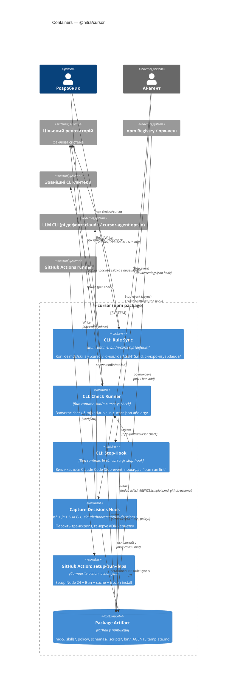

# CI4 / L2 — Containers

Виконувані одиниці й артефакти всередині пакету `@nitra/cursor`. Кожен runtime-контейнер — окремий процес зі своїми тригерами, користувачами та exit-кодом. Технічно три CLI-контейнери є різними субкомандами одного бінарника [`bin/n-cursor.js`](../../npm/bin/n-cursor.js); у CI4 моделюємо їх окремо, бо мають різні зовнішні інтерфейси і life-cycle.

## Діаграма

## Контейнери

| ID                      | Назва                         | Тип                  | Точка входу                                                                                          | Hook subroutine                                  |
| ----------------------- | ----------------------------- | -------------------- | ---------------------------------------------------------------------------------------------------- | ------------------------------------------------ |
| `cnt-rule-sync`         | CLI: Rule Sync                | Bun runtime          | `n-cursor` (без аргументів)                                                                          | —                                                |
| `cnt-check-runner`      | CLI: Check Runner             | Bun runtime          | `n-cursor check [...rules]`                                                                          | викликається з `cnt-stop-hook`                   |
| `cnt-stop-hook`         | CLI: Stop-Hook                | Bun runtime          | `n-cursor stop-hook`                                                                                 | реєструється Rule Sync у `.claude/settings.json` |
| `cnt-capture-decisions` | Capture-Decisions Hook        | Bash + jq + LLM CLI  | `.claude/hooks/capture-decisions.sh`                                                                 | реєструється Rule Sync (правило `adr`)           |
| `cnt-gh-action`         | GitHub Action: setup-bun-deps | composite action     | [`npm/github-actions/setup-bun-deps/action.yml`](../../npm/github-actions/setup-bun-deps/action.yml) | —                                                |
| `cnt-pkg-artifact`      | Package Artifact              | data store (tarball) | `node_modules/@nitra/cursor` або npx-кеш                                                             | —                                                |

### CLI: Rule Sync

**Тригер:** ручний (`npx @nitra/cursor`) або CI-step.
**Що робить:** читає `.n-cursor.json`, копіює правила з `mdc/` у `.cursor/rules/n-*.mdc`, skills із `skills/` у `.cursor/skills/n-*/`, перезаписує `AGENTS.md` із [`AGENTS.template.md`](../../npm/AGENTS.template.md), синхронізує `.claude/settings.json` (hooks/permissions merge), копіює `setup-bun-deps` у `.github/actions/`, додає `@nitra/cursor` у `devDependencies`.
**Деталі:** [03-components.md#cnt-rule-sync](03-components.md#cnt-rule-sync), [04-code.md#code-rule-sync](04-code.md#code-rule-sync).

### CLI: Check Runner

**Тригер:** ручний (`npx @nitra/cursor check`), із Stop-hook (`cnt-stop-hook`), із slash-команди `/n-check`.
**Що робить:** для кожного правила в argv (або з `.n-cursor.json`/`AGENTS.md`) запускає відповідний `scripts/check-<rule>.mjs`, агрегує результати через [`utils/check-reporter.mjs`](../../npm/scripts/utils/check-reporter.mjs), повертає exit code 0/1.
**Деталі:** [03-components.md#cnt-check-runner](03-components.md#cnt-check-runner), [04-code.md#code-check-runner](04-code.md#code-check-runner).

### CLI: Stop-Hook

**Тригер:** Claude Code Stop event через `.claude/settings.json` → `npx --no @nitra/cursor stop-hook`.
**Що робить:** читає stdin (JSONL), якщо `stop_hook_active === true` — exit 0 (рекурсивний guard), інакше spawn `npx @nitra/cursor check` і прокидає його exit code. Помилка перевірки блокує завершення ходу агента.
**Файл:** [`scripts/claude-stop-hook.mjs`](../../npm/scripts/claude-stop-hook.mjs).
**Деталі:** [03-components.md#cnt-stop-hook](03-components.md#cnt-stop-hook), [04-code.md#code-stop-hook](04-code.md#code-stop-hook).

### Capture-Decisions Hook

**Тригер:** Claude Code Stop event (друга hook-група, `async: true`), окремо від `cnt-stop-hook`.
**Що робить:** `ADR_HOOKS_SKIP=1` (виставлено підкомандою-оркестратором) — мовчки виходить одразу. Інакше читає JSONL-транскрипт сесії з `~/.claude/projects/...`, через `jq` витягає текст / thinking / tool_use, передає компактний дайджест в LLM CLI, обраний селектором `CAPTURE_DECISIONS_BACKEND` (дефолт `pi`, opt-in `claude`/`cursor-agent`/`auto`-каскад), записує результат у `docs/adr/_inbox/<timestamp>-<sid>.md`, якщо модель повернула блок з шапкою `## ADR|Runbook|Knowledge …`. На `NONE` нічого не пишеться.
**Файл:** [`.claude/hooks/capture-decisions.sh`](../../.claude/hooks/capture-decisions.sh) (інстальований [`scripts/sync-claude-config.mjs`](../../npm/scripts/sync-claude-config.mjs) при правилі `adr`).
**Деталі:** [03-components.md#cnt-capture-decisions](03-components.md#cnt-capture-decisions), [04-code.md#code-capture-decisions](04-code.md#code-capture-decisions).

### GitHub Action: setup-bun-deps

**Тригер:** workflow цільового репо `uses: ./.github/actions/setup-bun-deps`.
**Що робить:** 4 кроки composite action — `actions/setup-node@v6` (Node 24), `oven-sh/setup-bun@v2`, `actions/cache@v5` для `~/.bun/install/cache` + `node_modules`, `bun install --frozen-lockfile`.
**Файл:** [`npm/github-actions/setup-bun-deps/action.yml`](../../npm/github-actions/setup-bun-deps/action.yml).
**Деталь:** Rule Sync копіює action.yml у `.github/actions/setup-bun-deps/` цільового репо. Перевіряти або змінювати — у вихідному пакеті, не в копії.

### Package Artifact

**Тип:** data store (npm-tarball), читається всіма runtime-контейнерами.
**Складові:** `mdc/` (правила), `skills/` (slash-команди), `policy/` (rego-policies для conftest), `schemas/` (`n-cursor.json`, `v8r-catalog.json`), `scripts/` (всі `check-*`, `lint-*`, `run-*`, `utils/`), `bin/` (CLI), `AGENTS.template.md`, `CHANGELOG.md`.
**Розповсюдження:** через `npm publish` (запускається GitHub Actions workflow згідно з правилом `n-npm-module`); у цільовому проєкті — `node_modules/@nitra/cursor` або кеш npx.
**Реліз-правила:** [`npm/CLAUDE.md`](../../npm/CLAUDE.md), [`.cursor/rules/n-changelog.mdc`](../../.cursor/rules/n-changelog.mdc), [`.cursor/rules/n-npm-module.mdc`](../../.cursor/rules/n-npm-module.mdc).

## Чому 6 контейнерів, а не "одна CLI з 4 субкомандами"

Свідоме рішення моделювати окремо. Аргументи:

- **Різні тригери та actors:** Rule Sync — ручний / CI; Check Runner — ручний / Stop-hook / slash; Stop-Hook — Claude Code event; Capture-Decisions — Claude Code event (asynchronous, інша мова — bash).
- **Різні exit-code контракти:** Rule Sync — 0/non-zero для CI; Stop-Hook — exit code блокує hook; Capture-Decisions — завжди 0 (silent skip), щоб не блокувати агента.
- **Різні залежності:** Capture-Decisions потребує `jq` + LLM CLI у `PATH`; інші — лише `bun`.
- **Еволюція незалежна:** stop-hook міг би стати окремим бінарником без зміни решти; capture-decisions — окремою мовою (вже bash, не Node).

C4-канон допускає таке: контейнер — це "окремо розгортувана/виконувана одиниця, яка має свій life-cycle". Збіг бінарника не зобов'язує склеювати їх в один контейнер.

## Related decisions

| Element                                                         | ADR                                                                                                                                                                                    |
| --------------------------------------------------------------- | -------------------------------------------------------------------------------------------------------------------------------------------------------------------------------------- |
| Уся структура контейнерів                                       | [`docs/adr/_inbox/20260510-112235-20fb5843.md`](../adr/_inbox/20260510-112235-20fb5843.md)                                                                                             |
| `cnt-pkg-artifact` (правило `ci4.mdc`)                          | [`docs/adr/_inbox/20260510-112851-861696eb.md`](../adr/_inbox/20260510-112851-861696eb.md), [`docs/adr/_inbox/20260510-113127-861696eb.md`](../adr/_inbox/20260510-113127-861696eb.md) |
| `cnt-pkg-artifact` (`bun.mdc` ↔ rego узгодження root test-deps) | [`docs/adr/20260528-141519-bun-mdc-rego-узгодження-root-test-deps.md`](../adr/20260528-141519-bun-mdc-rego-узгодження-root-test-deps.md)                                               |
| `cnt-check-runner` (`n-cursor coverage` always-on `test`)       | [`docs/adr/20260528-142508-test-правило-always-on.md`](../adr/20260528-142508-test-правило-always-on.md)                                                                               |

Повний індекс — у [`decisions.md`](decisions.md).
