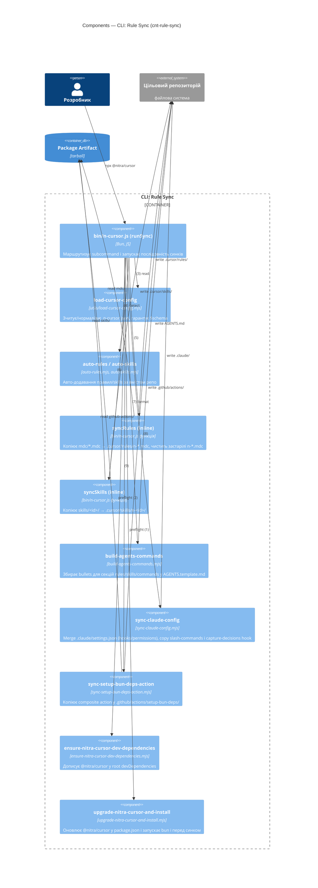
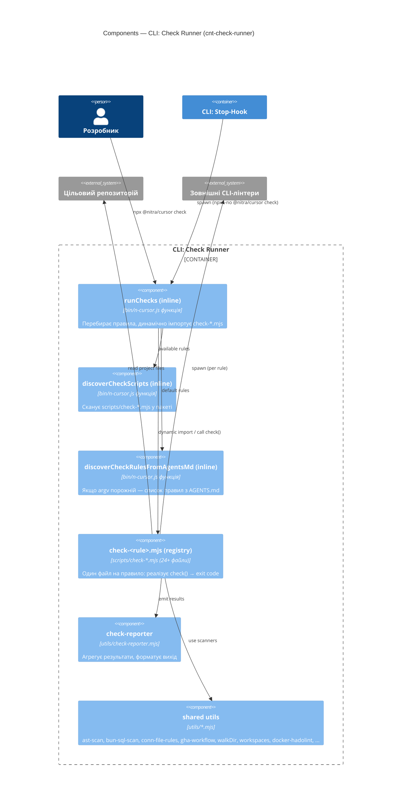
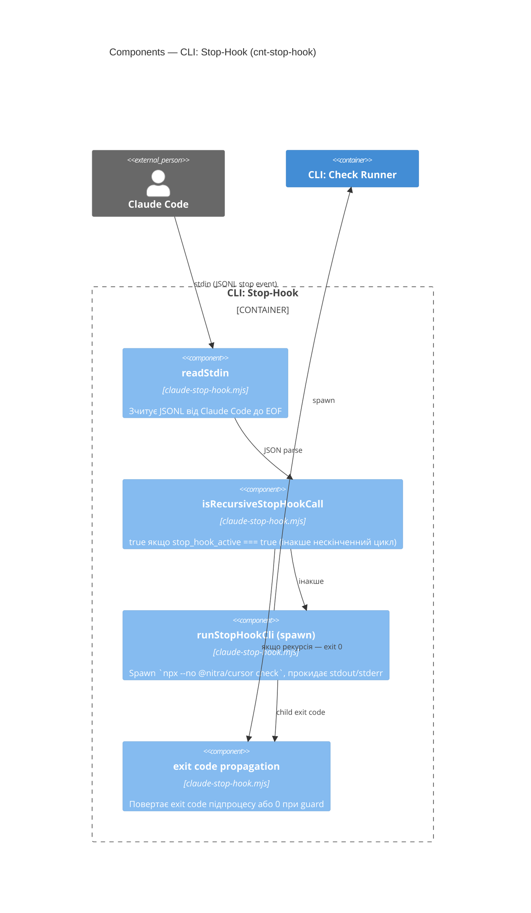
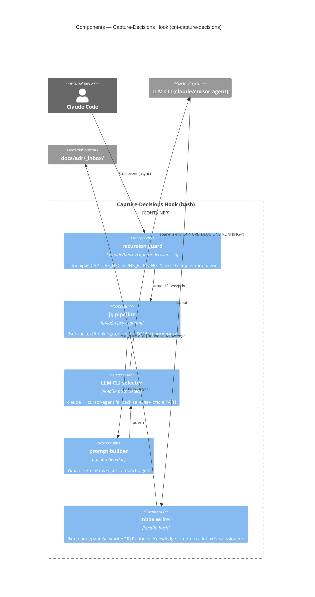

# CI4 / L3 — Components

Внутрішні компоненти кожного runtime-контейнера. Обов'язкова колонка `Tests` — посилання на одиничні тести в [`npm/tests/`](../../npm/tests/) (правило [`n-ci4`](../../.cursor/rules/n-ci4.mdc), принцип "Зв'язок із тестами"). Якщо одиничного тесту немає — `—` із записом у [`decisions.md`](decisions.md) як технічний борг.

GH Action ([`cnt-gh-action`](02-containers.md#cnt-gh-action)) і Package Artifact ([`cnt-pkg-artifact`](02-containers.md#cnt-pkg-artifact)) на L3 не розкриваються (тривіальна структура — див. L2).

## CLI: Rule Sync

| Component ID        | Файл                                                                                                     | Опис                                                                  | Tests                                                                                                            |
| ------------------- | -------------------------------------------------------------------------------------------------------- | --------------------------------------------------------------------- | ---------------------------------------------------------------------------------------------------------------- |
| `cmp-cli-main`      | [`bin/n-cursor.js`](../../npm/bin/n-cursor.js) (`runSync`)                                               | Маршрутизація subcommand, оркестрація синку                           | — (integration test: [`integration-repo-checks.test.mjs`](../../npm/tests/integration-repo-checks.test.mjs))     |
| `cmp-load-config`   | [`utils/load-cursor-config.mjs`](../../npm/scripts/utils/load-cursor-config.mjs)                         | Читання й нормалізація `.n-cursor.json`, $schema                      | [`utils-load-cursor-config.test.mjs`](../../npm/tests/utils-load-cursor-config.test.mjs)                         |
| `cmp-auto-rules`    | [`auto-rules.mjs`](../../npm/scripts/auto-rules.mjs)                                                     | Авто-додавання правил за вмістом репо                                 | [`auto-rules.test.mjs`](../../npm/tests/auto-rules.test.mjs)                                                     |
| `cmp-auto-skills`   | [`auto-skills.mjs`](../../npm/scripts/auto-skills.mjs)                                                   | Авто-додавання skills                                                 | [`auto-skills.test.mjs`](../../npm/tests/auto-skills.test.mjs)                                                   |
| `cmp-sync-rules`    | inline в `bin/n-cursor.js`                                                                               | Копія `mdc/` → `.cursor/rules/n-*.mdc`, чистка застарілих             | — (integration)                                                                                                  |
| `cmp-sync-skills`   | inline в `bin/n-cursor.js`                                                                               | Копія `skills/` → `.cursor/skills/n-*/`                               | — (integration)                                                                                                  |
| `cmp-build-agents`  | [`build-agents-commands.mjs`](../../npm/scripts/build-agents-commands.mjs)                               | Mustache-render `AGENTS.template.md` (rules/skills/commands)          | [`agents-md-commands.test.mjs`](../../npm/tests/agents-md-commands.test.mjs)                                     |
| `cmp-sync-claude`   | [`sync-claude-config.mjs`](../../npm/scripts/sync-claude-config.mjs)                                     | `.claude/settings.json` merge, slash-commands, capture-decisions hook | [`sync-claude-config.test.mjs`](../../npm/tests/sync-claude-config.test.mjs)                                     |
| `cmp-sync-gha`      | [`sync-setup-bun-deps-action.mjs`](../../npm/scripts/sync-setup-bun-deps-action.mjs)                     | Копія composite action                                                | [`sync-setup-bun-deps-action.test.mjs`](../../npm/tests/sync-setup-bun-deps-action.test.mjs)                     |
| `cmp-ensure-devdep` | [`ensure-nitra-cursor-dev-dependencies.mjs`](../../npm/scripts/ensure-nitra-cursor-dev-dependencies.mjs) | Додавання `@nitra/cursor` у `devDependencies`                         | [`ensure-nitra-cursor-dev-dependencies.test.mjs`](../../npm/tests/ensure-nitra-cursor-dev-dependencies.test.mjs) |
| `cmp-upgrade`       | [`upgrade-nitra-cursor-and-install.mjs`](../../npm/scripts/upgrade-nitra-cursor-and-install.mjs)         | Bump `@nitra/cursor` і `bun i` перед синком                           | [`upgrade-nitra-cursor-and-install.test.mjs`](../../npm/tests/upgrade-nitra-cursor-and-install.test.mjs)         |

## CLI: Check Runner

| Component ID             | Файл                                                                                                                                                                                                                                                                                                   | Опис                                                          | Tests                                                                                                                                                                                                                                                                                                                                                                                                                                                                                                                                                                                                                                                                                                                                                                                                                                                                                                              |
| ------------------------ | ------------------------------------------------------------------------------------------------------------------------------------------------------------------------------------------------------------------------------------------------------------------------------------------------------ | ------------------------------------------------------------- | ------------------------------------------------------------------------------------------------------------------------------------------------------------------------------------------------------------------------------------------------------------------------------------------------------------------------------------------------------------------------------------------------------------------------------------------------------------------------------------------------------------------------------------------------------------------------------------------------------------------------------------------------------------------------------------------------------------------------------------------------------------------------------------------------------------------------------------------------------------------------------------------------------------------ |
| `cmp-check-orchestrator` | inline `runChecks` в [`bin/n-cursor.js`](../../npm/bin/n-cursor.js)                                                                                                                                                                                                                                    | Перебирає правила, dynamic import, агрегує exit               | — (integration test: [`integration-repo-checks.test.mjs`](../../npm/tests/integration-repo-checks.test.mjs))                                                                                                                                                                                                                                                                                                                                                                                                                                                                                                                                                                                                                                                                                                                                                                                                       |
| `cmp-check-discover`     | inline `discoverCheckScripts`, `discoverCheckRulesFromAgentsMd`                                                                                                                                                                                                                                        | Дискавері check-скриптів і правил з `AGENTS.md`               | —                                                                                                                                                                                                                                                                                                                                                                                                                                                                                                                                                                                                                                                                                                                                                                                                                                                                                                                  |
| `cmp-check-reporter`     | [`utils/check-reporter.mjs`](../../npm/scripts/utils/check-reporter.mjs)                                                                                                                                                                                                                               | Формат і агрегація результатів                                | [`check-reporter.test.mjs`](../../npm/tests/check-reporter.test.mjs)                                                                                                                                                                                                                                                                                                                                                                                                                                                                                                                                                                                                                                                                                                                                                                                                                                               |
| `cmp-check-rule-<id>`    | `scripts/check-<id>.mjs` (24+ файли — `abie`, `adr`, `bun`, `capacitor`, `changelog`, `docker`, `ga`, `graphql`, `hasura`, `image-avif`, `image-compress`, `js-bun-db`, `js-bun-redis`, `js-lint`, `js-mssql`, `js-run`, `k8s`, `nginx-default-tpl`, `npm-module`, `php`, `style-lint`, `text`, `vue`) | Один файл — одне правило, експортує `check()`                 | відповідні `check-<id>.test.mjs` (більшість покрита)                                                                                                                                                                                                                                                                                                                                                                                                                                                                                                                                                                                                                                                                                                                                                                                                                                                               |
| `cmp-check-utils-shared` | [`utils/`](../../npm/scripts/utils/) (ast-scan, scanners, walkDir, workspaces, docker-hadolint, ...)                                                                                                                                                                                                   | Спільні сканери, що використовуються кількома check-правилами | [`utils-pass.test.mjs`](../../npm/tests/utils-pass.test.mjs), [`utils-walkDir.test.mjs`](../../npm/tests/utils-walkDir.test.mjs), [`utils-workspaces.test.mjs`](../../npm/tests/utils-workspaces.test.mjs), [`utils-docker-hadolint.test.mjs`](../../npm/tests/utils-docker-hadolint.test.mjs), [`bunyan-imports.test.mjs`](../../npm/tests/bunyan-imports.test.mjs), [`redis-imports.test.mjs`](../../npm/tests/redis-imports.test.mjs), [`conn-file-rules.test.mjs`](../../npm/tests/conn-file-rules.test.mjs), [`conn-imports-scan.test.mjs`](../../npm/tests/conn-imports-scan.test.mjs), [`promise-settimeout-scan.test.mjs`](../../npm/tests/promise-settimeout-scan.test.mjs), [`vue-forbidden-imports.test.mjs`](../../npm/tests/vue-forbidden-imports.test.mjs), [`gha-workflow.test.mjs`](../../npm/tests/gha-workflow.test.mjs), [`docker-discover.test.mjs`](../../npm/tests/docker-discover.test.mjs) |

## CLI: Stop-Hook

| Component ID               | Файл                                                                                         | Опис                                 | Tests |
| -------------------------- | -------------------------------------------------------------------------------------------- | ------------------------------------ | ----- |
| `cmp-stop-reader`          | [`claude-stop-hook.mjs`](../../npm/scripts/claude-stop-hook.mjs) (`readStdin`)               | Зчитує stdin до EOF                  | —     |
| `cmp-stop-guard`           | [`claude-stop-hook.mjs`](../../npm/scripts/claude-stop-hook.mjs) (`isRecursiveStopHookCall`) | Рекурсія-guard за `stop_hook_active` | —     |
| `cmp-stop-spawner`         | [`claude-stop-hook.mjs`](../../npm/scripts/claude-stop-hook.mjs) (`runStopHookCli`)          | Spawn check + propagate exit         | —     |
| `cmp-stop-exit-marshaller` | inline в `runStopHookCli`                                                                    | Нормалізація exit code               | —     |

Контейнер Stop-Hook не має одиничних тестів — це технічний борг (див. [`decisions.md`](decisions.md)).

## Capture-Decisions Hook

| Component ID             | Файл                                                                         | Опис                                                                      | Tests |
| ------------------------ | ---------------------------------------------------------------------------- | ------------------------------------------------------------------------- | ----- |
| `cmp-cd-recursion-guard` | `.claude/hooks/capture-decisions.sh` (env-check `CAPTURE_DECISIONS_RUNNING`) | Запобігає циклу: внутрішній виклик LLM не повинен спричинити свій же hook | —     |
| `cmp-cd-jq-pipeline`     | `.claude/hooks/capture-decisions.sh` (jq-команди)                            | Парсинг JSONL транскрипту                                                 | —     |
| `cmp-cd-cli-selector`    | `.claude/hooks/capture-decisions.sh` (`command -v` chain)                    | Вибір `claude` → `cursor-agent` за наявністю в `PATH`                     | —     |
| `cmp-cd-prompt-builder`  | `.claude/hooks/capture-decisions.sh` (heredoc)                               | Український промпт з digest                                               | —     |
| `cmp-cd-inbox-writer`    | `.claude/hooks/capture-decisions.sh` (heuristic + write)                     | Збереження ADR/Runbook/Knowledge у `_inbox/`                              | —     |

Контейнер Capture-Decisions написаний на bash і не має одиничних тестів — також технічний борг ([`decisions.md`](decisions.md)). Канонічне джерело скрипта — у пакеті (інстальований Rule Sync); вихідний шлях канонізованої копії в репозиторії пакета — TBD (потенційно `npm/.claude-template/hooks/capture-decisions.sh`); подивіться `cmp-sync-claude` для деталей інсталяції.

## Related decisions

| Element                                       | ADR                                                                                                      |
| --------------------------------------------- | -------------------------------------------------------------------------------------------------------- |
| Усі L3-компоненти (загальна структура)        | [`docs/adr/_inbox/20260510-112235-20fb5843.md`](../adr/_inbox/20260510-112235-20fb5843.md)               |
| `cmp-sync-claude` (capture-decisions install) | [`docs/adr/_inbox/20260510-112851-861696eb.md`](../adr/_inbox/20260510-112851-861696eb.md)               |
| `cmp-auto-rules` (`test` always-on)           | [`docs/adr/20260528-142508-test-правило-always-on.md`](../adr/20260528-142508-test-правило-always-on.md) |

Повний індекс — у [`decisions.md`](decisions.md).
