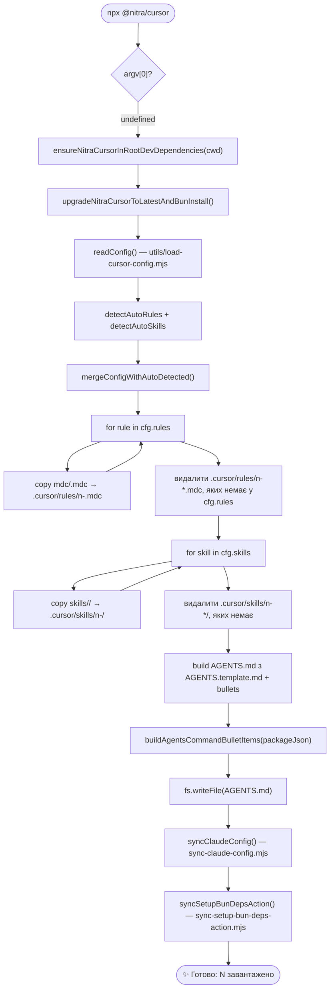
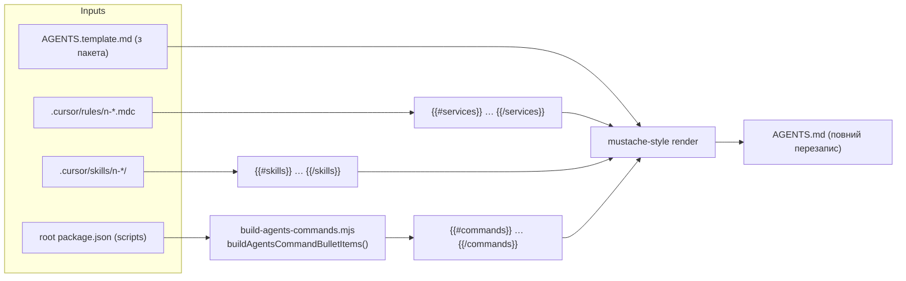
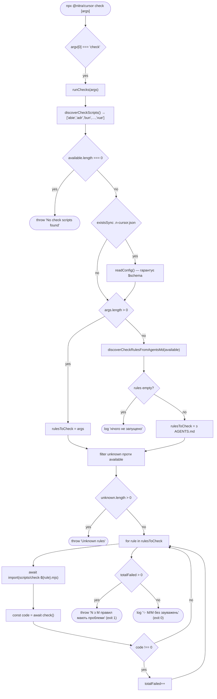
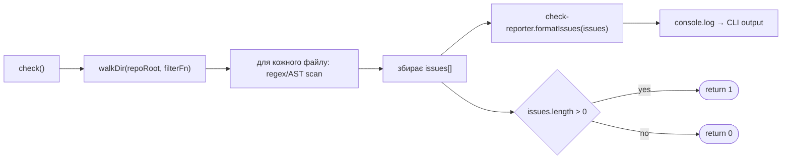
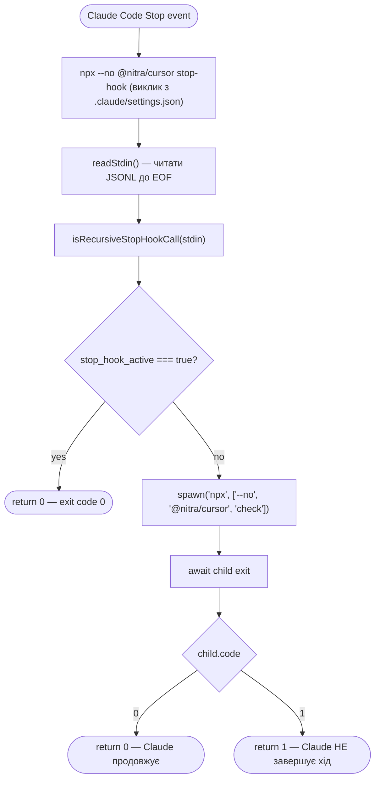
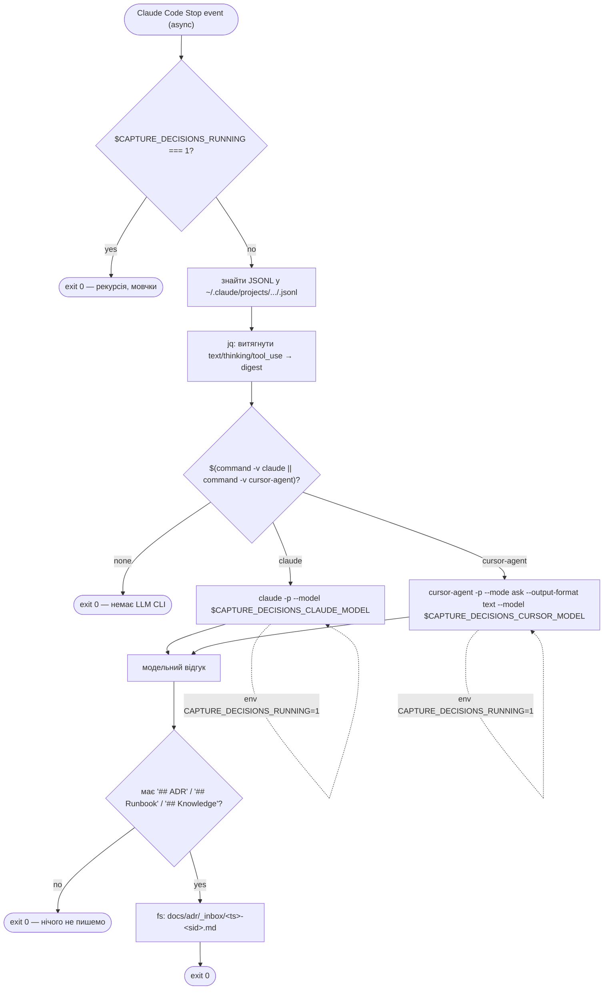

# CI4 / L4 — Code

Code-flow для всіх runtime-контейнерів. Mermaid `flowchart TD` (top-down) — потоки керування й даних на рівні файлів і експортованих функцій. GH Action ([`cnt-gh-action`](02-containers.md#cnt-gh-action)) і Package Artifact ([`cnt-pkg-artifact`](02-containers.md#cnt-pkg-artifact)) на L4 не розкриваються.

## Rule Sync

Послідовність `bin/n-cursor.js` без аргументів (default-команда `runSync`):

**Експорт компонентів:** [`cmp-load-config`](03-components.md#cnt-rule-sync), [`cmp-auto-rules`](03-components.md#cnt-rule-sync), [`cmp-auto-skills`](03-components.md#cnt-rule-sync), [`cmp-build-agents`](03-components.md#cnt-rule-sync), [`cmp-sync-claude`](03-components.md#cnt-rule-sync), [`cmp-sync-gha`](03-components.md#cnt-rule-sync), [`cmp-ensure-devdep`](03-components.md#cnt-rule-sync), [`cmp-upgrade`](03-components.md#cnt-rule-sync).

## AGENTS Builder (sub-flow)

Деталь під-потоку, який збирає `AGENTS.md` (всередині [`code-rule-sync`](#code-rule-sync), вузли `agents` → `bullets` → `writeAgents`):

**Свідомі властивості:**

- Шаблон у пакеті ([`AGENTS.template.md`](../../npm/AGENTS.template.md)) — джерело істини; редагувати згенерований `AGENTS.md` у проєкті користувача безглуздо (наступний sync переписує).
- `{{#commands}}` — фіксований порядок відомих ключів `package.json scripts` плюс додаткові `lint-*`, плюс канонічні рядки про `npx @nitra/cursor` і `npx @nitra/cursor check`. Логіка — у [`build-agents-commands.mjs`](../../npm/scripts/build-agents-commands.mjs).
- `{{#services}}` (правила) і `{{#skills}}` (skills) формуються зі стану диска `.cursor/rules/` та `.cursor/skills/` — туди потрапляють і керовані `n-*`, і будь-які інші, додані вручну.

## Check Runner

`bin/n-cursor.js → runChecks(args)`:

**Приклад одного `check-*.mjs` ([`check-text.mjs`](../../npm/scripts/check-text.mjs) — спрощено):**

Контракт `check-*.mjs`: експортує `check(): Promise<0 | 1>`. Сторонні сканери — у [`utils/`](../../npm/scripts/utils/) (наприклад, `bunyan-imports.mjs`, `redis-imports.mjs`, `conn-file-rules.mjs`).

## Stop-Hook

`bin/n-cursor.js stop-hook → runStopHookCli()`:

**Властивості:**

- TTY-fallback: якщо stdin — TTY (запуск вручну), `readStdin` повертає `''` миттєво; `guard` повертає `false`; запускається `check` як для звичайного CLI.
- Помилка `JSON.parse` у guard вважається "не рекурсія" (fallback на `false`).
- Лог Claude Code сам зберігає stdout/stderr дочірнього процесу.

## Capture-Decisions

`.claude/hooks/capture-decisions.sh` (bash):

**Властивості:**

- Скрипт **завжди** завершує `exit 0` (за винятком ранніх hard-fail) — щоб не блокувати агента.
- `--mode ask` для `cursor-agent` навмисний: read-only Q&A режим без shell/edit.
- Дефолтні моделі: `claude → sonnet`, `cursor-agent → claude-4.6-sonnet-medium`. Перевизначення — env-vars `CAPTURE_DECISIONS_CLAUDE_MODEL`, `CAPTURE_DECISIONS_CURSOR_MODEL`.
- Канонічне джерело bash-скрипта — у пакеті; інстальоване [`cmp-sync-claude`](03-components.md#cnt-rule-sync) при правилі `adr` у `.n-cursor.json`.

## Related decisions

| Element                                             | ADR                                                                                        |
| --------------------------------------------------- | ------------------------------------------------------------------------------------------ |
| Code-flow для всіх runtime-контейнерів              | [`docs/adr/_inbox/20260510-112235-20fb5843.md`](../adr/_inbox/20260510-112235-20fb5843.md) |
| `code-capture-decisions` — bash-flow і LLM-fallback | [`docs/adr/_inbox/20260510-112851-861696eb.md`](../adr/_inbox/20260510-112851-861696eb.md) |

Повний індекс — у [`decisions.md`](decisions.md).
