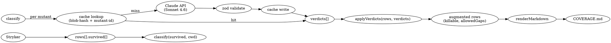

# `n-cursor coverage` — LLM-assisted classification of survived mutants

## Motivation

Поточний coverage-pipeline (`n-cursor coverage`) ставить за мету 100% line + 100% mutation score. Це створює шум: змушує писати тести на CLI-обгортки, 3-рядкові стаби (`rules/*/fix.mjs`), `spawnSync`-wrappers і defensive-гілки, які за своєю природою не дають реального сигналу регресії. Команда втрачає час на тести з низьким ROI, а агрегований score не відображає реальної якості coverage.

Дизайн вводить LLM-класифікатор, що для кожного survived мутанта виносить вердикт зі списку: `worth-testing | equivalent | defensive | glue | wrapper`. **«Killable» mutation score** рахується тільки на тих, які `worth-testing` або `confidence < 0.7`. Решта — «Allowed gaps» з reasoning. Сирий Raw score теж показується для прозорості.

## Constraints / non-goals

- **MVP**: класифікація лише survived **mutants**. Uncovered files (повністю непокриті) — v2.
- LLM — **класифікатор, не вирішувач**: всі вердикти зберігаються в кеш з reasoning + confidence + model + date; будь-який майбутній review може передивитися.
- **Не блокер**: відсутність `ANTHROPIC_API_KEY` / network error / SDK не встановлено → coverage завершується успішно з Raw score; класифікація скіпається з `console.warn`.
- **Cost**: один `n-cursor coverage` має платити LLM-токени лише за мутанти з НОВИМИ source-changes (cache по `git-blob-hash`).

## Architecture

```
npm/scripts/coverage-classify/
  ├─ index.mjs           # public: classify(survived, cwd) → verdicts[]
  ├─ prompt.mjs          # buildSystemPrompt(), buildUserPrompt(item, ctx) — pure
  ├─ cache.mjs           # readCache/writeCache, keyed by git-blob-hash + mutant-id
  ├─ verdict-schema.mjs  # zod schema, validate(rawResponse) → Verdict | throw
  ├─ apply.mjs           # applyVerdicts(rows, verdicts) → { killableRows, allowedGaps }
  └─ tests/
       ├─ cache.test.mjs
       ├─ verdict-schema.test.mjs
       ├─ prompt.test.mjs
       ├─ apply.test.mjs
       └─ index.test.mjs (mocked SDK, integration)

npm/rules/test/coverage/coverage.mjs
  └─ runCoverageSteps:
       1. discover providers → collect rows
       2. → NEW: classify(rows.flatMap(r => r.survived ?? []), cwd) → verdicts
       3. → NEW: applyVerdicts(rows, verdicts) → augmented rows
       4. renderMarkdown(augmentedRows) → COVERAGE.md
```

## Data flow



## Verdict schema (zod)

```js
const VerdictSchema = z.object({
  verdict: z.enum([
    'worth-testing', // pure logic, real branches — write a test
    'equivalent', // mutant is behaviorally equivalent — cannot be killed
    'defensive', // branch for impossible state — cannot be reached
    'glue', // CLI entry/runStandardRule wrapper — integration covers
    'wrapper' // thin spawn/fetch wrapper — integration covers
  ]),
  confidence: z.number().min(0).max(1),
  reason: z.string().min(20).max(500), // ≥20 chars змушує пояснити
  suggestedTest: z.string().max(300).optional() // лише для worth-testing
})
// v2 додасть поле `category: 'mutant' | 'uncovered-file'`. У v1 — нема, бо лише mutants.
```

**Skip rule для Allowed gaps**:

```
verdict in [equivalent, defensive, glue, wrapper] AND confidence >= 0.7 → allowed-gap
```

Решта (включно з `confidence < 0.7`) → `Killable`. Conservative: при низькій впевненості мутант не пропадає з знаменника.

## Prompt design (with prompt caching)

### System prompt (cached, 1h TTL)

Один на прогон. Містить:

- Опис кожної категорії з 1-2 прикладами.
- Чітку інструкцію виводу: only JSON, відповідає `VerdictSchema`.
- Constraints:
  - для `equivalent` ОБОВ'ЯЗКОВО назвати конкретну поведінкову причину (наприклад: «обидва значення проходять через `if (!opts.fix)` як falsy»);
  - для `defensive` — обґрунтувати impossible state з reference до контрактів вхідних типів;
  - для `glue/wrapper` — назвати конкретний integration test чи patterns (e.g., `runStandardRule`-shaped) що це покриває;
  - `confidence > 0.9` дозволяється лише з reference до конкретного фрагменту коду.

### User prompt (per item)

```
# Mutant
File: <file>
Line: <line>:<col>
Type: <mutantType>
Original code: `<original>`
Mutated to: `<replacement>`

# Source context (±10 lines)
<src lines L-10 .. L+10 з line numbers>

# Existing tests (1-level deep)
<вміст `<dir>/tests/<basename>.test.mjs` якщо < 2000 рядків, інакше — список describe/test заголовків>

# Recent activity
File last modified: <git log -1 --format=%ar -- <file>>
```

### API виклик

```js
const { default: Anthropic } = await import('@anthropic-ai/sdk')
const client = new Anthropic()
const response = await client.messages.create({
  model: 'claude-sonnet-4-6',
  max_tokens: 1024,
  system: [{ type: 'text', text: SYSTEM_PROMPT, cache_control: { type: 'ephemeral' } }],
  messages: [{ role: 'user', content: userPromptText }]
})
const verdict = VerdictSchema.parse(JSON.parse(extractJsonBlock(response.content[0].text)))
```

## Cache shape

`npm/reports/coverage-classify.cache.json` (gitignored, per-machine):

```json
{
  "version": 1,
  "model": "claude-sonnet-4-6",
  "entries": {
    "<git-blob-hash>:<line>:<col>:<replacement-base64>": {
      "verdict": "equivalent",
      "confidence": 0.85,
      "reason": "...",
      "category": "mutant",
      "classifiedAt": "2026-05-30T12:00:00Z"
    }
  }
}
```

**Key format**: `<blob-hash-source-file>:<line>:<col>:<base64url(replacement)>`. Hash рахуємо через `git hash-object <file>` — детерміноване значення SHA-1 контенту, що працює на working-tree-копії незалежно від commit-стану. При будь-якій зміні source → новий hash → cache miss → re-classify. `replacement` як base64url — щоб не ламати ключ символами `:`, `/` чи `\n`.

Якщо `git hash-object` недоступний (немає git або файл не існує) — fallback на `sha1(readFile(path))` через node:crypto.

**`.gitignore`**:

```
npm/reports/coverage-classify.cache.json
```

## Error handling

| Помилка                             | Поведінка                                                                                                                                                            |
| ----------------------------------- | -------------------------------------------------------------------------------------------------------------------------------------------------------------------- |
| Немає `ANTHROPIC_API_KEY`           | `console.warn` → `'⚠ coverage classify: ANTHROPIC_API_KEY not set, classification skipped'`; COVERAGE.md показує Raw score з рядком `Classify: skipped (no API key)` |
| Network timeout / 5xx               | Retry 2× з exp backoff (1s, 4s); після — warn-and-skip per item                                                                                                      |
| Rate limit (429)                    | Retry після `Retry-After` header; після 3 спроб — warn-and-skip per item                                                                                             |
| Invalid JSON у LLM-відповіді        | Один retry з explicit instruction «return ONLY valid JSON»; після — conservative fallback verdict `worth-testing` (mutant НЕ йде в allowed-gaps)                     |
| Zod schema validation fail          | Те саме: один retry, потім conservative fallback                                                                                                                     |
| `@anthropic-ai/sdk` не встановлений | Dynamic import miss → warn-and-skip усього кроку (як у `coverage-fix.mjs`)                                                                                           |

**Fallback verdict** при будь-якій нерозв'язній помилці per-item:

```js
{ verdict: 'worth-testing', confidence: 0, reason: 'LLM-classification unavailable, conservative fallback', category: 'mutant' }
```

Mutant залишається в Killable знаменнику — score не «штучно завищується» через помилку.

## COVERAGE.md rendering

Існуюча таблиця доповнюється:

```md
# Coverage

| Область   | Рядки        | Функції      | Killable | Score      |
| --------- | ------------ | ------------ | -------- | ---------- |
| JS        | 78.80% (...) | 86.13% (...) | 132/137  | **96.35%** |
| **Разом** | 78.80% (...) | 86.13% (...) | 132/137  | **96.35%** |

> Raw mutation: 132/141 (93.62%). 4 з 141 — Allowed gaps (LLM-classified).
> Classify model: claude-sonnet-4-6. Updated: 2026-05-30T12:00:00Z.

## Allowed gaps (4)

### npm/rules/test/coverage/coverage.mjs

| Line | Mutant                  | Verdict    | Confidence | Reason                                     |
| ---- | ----------------------- | ---------- | ---------: | ------------------------------------------ |
| 189  | `pts.fix)` → `true`     | equivalent |       0.85 | ...                                        |
| 211  | ` fix: false })` → `{}` | equivalent |       0.92 | обидва значення дають falsy `opts.fix` ... |
| ...  |                         |            |            |                                            |

## Killable mutants (5)

Залишаються survived мутанти, які LLM класифікував як worth-testing або з низькою впевненістю.
Деталі — як було (...)
```

## Testing strategy

### Unit tests (TDD-first)

- **`cache.test.mjs`**:
  - read miss → null;
  - write → read returns saved entry;
  - hash mismatch → null (інвалідація);
  - corrupted JSON у файлі → return empty cache, не throw;
  - schema version mismatch → return empty cache.
- **`verdict-schema.test.mjs`**:
  - валідні verdicts проходять;
  - reason < 20 символів → reject;
  - confidence > 1 чи < 0 → reject;
  - unknown verdict-enum → reject;
  - suggestedTest > 300 символів → reject.
- **`prompt.test.mjs`**:
  - snapshot test для `buildSystemPrompt()`;
  - `buildUserPrompt(mutant, context)` — містить файл, рядок, original→replacement, source-context;
  - file > 2000 рядків → містить describe/test signatures, не повний текст.
- **`apply.test.mjs`**:
  - 3 verdicts (equivalent, worth-testing, wrapper) → 2 → allowedGaps, 1 → залишається в survived;
  - `confidence < 0.7` для equivalent → залишається в survived (conservative);
  - Killable score переписується правильно.

### Integration tests (mocked SDK)

`index.test.mjs`:

- mock `@anthropic-ai/sdk` через `vi.mock` з factory, що повертає preset відповіді;
- сценарій 1: 3 mutants → класифікація → applyVerdicts → перевіряємо augmented rows;
- сценарій 2: cache miss → call SDK → cache write → 2nd call → cache hit (SDK NOT called);
- сценарій 3: SDK throws → conservative fallback → coverage не падає;
- сценарій 4: `ANTHROPIC_API_KEY` unset → warn-and-skip → класифікація скіпнута, augmentedRows == rawRows.

### End-to-end

**Не робимо** в CI — потребує справжнього API key і витрачає токени. Замість того — manual smoke test перед merge: вимкнути cache, прогнати `n-cursor coverage` на cursor repo, перевірити що 4 існуючі мутанти класифікуються розумно.

## Dependencies (нові)

- `@anthropic-ai/sdk` — додати в `npm/package.json#dependencies` (вже опосередковано через `claude-agent-sdk`, але потрібен явний прямий dep для нашого use-case).
- `zod` — додати, якщо ще нема. Альтернатива — manual validation, але zod robustly краще.

## Migration / rollout

`apply.mjs` приймає `confidenceThreshold` як аргумент (default 0.7). Параметр читається з `.n-cursor.json#coverage.classifyConfidenceThreshold` (опційне поле) — без явного значення = default.

1. Першу версію викочуємо з `confidenceThreshold = 1.1` у `.n-cursor.json` (**жоден verdict не дійде до allowed-gaps**) — збирає реальні дані LLM-класифікації, але не міняє користувачам score.
2. Після 1-2 тижнів реальних прогонів і ручної ревізії sample-verdicts — знижуємо до 0.7 (default).
3. v2 (uncovered files) додається окремою spec.

## File ownership

Реалізація — у `npm/scripts/coverage-classify/`. Тести — поряд (`tests/` піддиректорія). Інтеграція — точкова правка `npm/rules/test/coverage/coverage.mjs` (1 import + 2 виклики).

## Open questions

- (Залишити закритими в MVP — рішення прийняті в brainstorming):
  - Cache strategy: file-hash-keyed (вибрано).
  - Input scope MVP: survived mutants only (uncovered files → v2).
  - Model: Sonnet 4.6 (вибрано).
  - CLI: автоматично в `n-cursor coverage` (вибрано).
